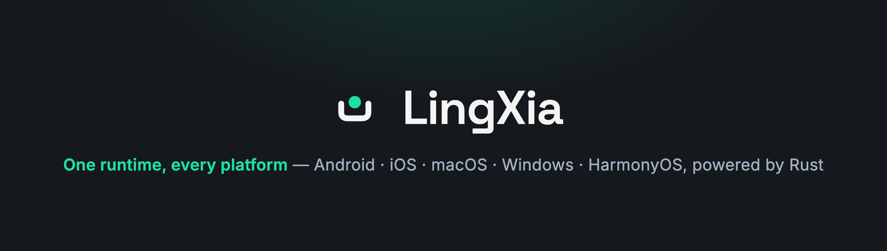

<p align="center">
  
</p>

<p align="center">
  /lɪŋ ʃiə/ - Cross-platform app runtime for lxapps, native host apps, and Rust extensions
</p>

<p align="center">
  <a href="https://github.com/LingXia-Dev/LingXia/actions/workflows/ci.yml"></a>
</p>

<p align="center">
  <a href="docs/quick-start.md">Quick Start</a> &middot;
  <a href="docs/skill/SKILL.md">AI Skill</a> &middot;
  <a href="docs/skill/lxapp/guide.md">LxApp Guide</a> &middot;
  <a href="docs/skill/app/project.md">Host Apps</a> &middot;
  <a href="docs/skill/cli/reference.md">CLI Reference</a>
</p>

---

LingXia is a cross-platform app framework for building **standalone lxapps** and **native host apps** on Android, iOS, macOS, HarmonyOS, and Windows.

An lxapp is a page-based mini-app with a strict split between:

| Layer | Runs in | Owns |
|---|---|---|
| **View** | WebView | React, Vue, or HTML rendering |
| **Logic** | Native JavaScript runtime or Rust host code | state, business logic, platform API calls |
| **Bridge** | Rust runtime | `setData`, streams, channels, and native calls |

This keeps UI rendering separate from business work. View code renders; Logic code owns state and platform APIs; the bridge moves data and events between them.

## What You Build

| Shape | Use when | Starting point |
|---|---|---|
| **Standalone lxapp** | You are building pages that run inside any LingXia host. | `lingxia new my-lxapp -t lxapp -y` |
| **Native host app** | You need an installable Android, iOS, macOS, Harmony, or Windows app embedding one or more lxapps. | `lingxia new my-app -t native-app -p macos --package-id com.example.myapp -y` |
| **Rust native extension** | You need host APIs, background services, native file/media integration, or Rust-owned app logic. | `#[lingxia::native]` plus `HostAddon` |

## Quick Start

Install the CLI.

**macOS** (or Git Bash, MSYS, Cygwin on Windows):

```bash
curl -fsSL https://raw.githubusercontent.com/LingXia-Dev/LingXia/main/install.sh | sh
lingxia version
```

**Windows PowerShell:**

```powershell
irm https://raw.githubusercontent.com/LingXia-Dev/LingXia/main/install.ps1 | iex
lingxia version
```

Create and run a native host app:

```bash
lingxia new my-app -t native-app -p macos --package-id com.example.myapp -y
cd my-app
lingxia dev
```

Or create a standalone lxapp:

```bash
lingxia new my-lxapp -t lxapp -y
cd my-lxapp
lingxia dev
```

See [Quick Start](docs/quick-start.md) for Node.js, platform SDK, Android NDK, Harmony, Xcode, and Rust setup notes.

## AI Assistant Skill

LingXia ships an agent-oriented markdown skill as `@lingxia/skill`. It contains the decision tree, CLI reference, lxapp recipes, native component docs, `lx.*` API map, host project docs, and Rust native development guide.

For Claude Code / Anthropic Skills:

```bash
npx @lingxia/skill install
```

For OpenAI Codex CLI:

```bash
npx @lingxia/skill install --agents-md
```

Codex reads `AGENTS.md`, so `--agents-md` installs the skill and adds a pointer from `<project>/AGENTS.md` to `.claude/skills/lingxia/SKILL.md`. The skill content is still plain markdown, so Cursor, GitHub Copilot, and other tools can use the same files when pointed at the installed `SKILL.md`.

Browse the source directly at [docs/skill/SKILL.md](docs/skill/SKILL.md), or read the package docs at [packages/lingxia-skill/README.md](packages/lingxia-skill/README.md).

## Documentation

| Need | Doc |
|---|---|
| Install CLI and create the first project | [docs/quick-start.md](docs/quick-start.md) |
| Agent entrypoint and topic router | [docs/skill/SKILL.md](docs/skill/SKILL.md) |
| Page authoring, `Page({})`, `useLxPage`, events | [docs/skill/lxapp/guide.md](docs/skill/lxapp/guide.md) |
| Native components such as `LxInput`, `LxVideo`, `LxPicker` | [docs/skill/lxapp/components.md](docs/skill/lxapp/components.md) |
| Logic-side `lx.*` API surface | [docs/skill/lxapp/lx-api.md](docs/skill/lxapp/lx-api.md) |
| Bridge mechanics: `setData`, stream, channel | [docs/skill/lxapp/bridge.md](docs/skill/lxapp/bridge.md) |
| Host project config and `lingxia.yaml` | [docs/skill/app/project.md](docs/skill/app/project.md) |
| iOS/macOS SDK embedding | [docs/skill/app/apple-sdk.md](docs/skill/app/apple-sdk.md) |
| Universal links and app links | [docs/skill/app/applinks.md](docs/skill/app/applinks.md) |
| Rust native routes and host addons | [docs/skill/native/development.md](docs/skill/native/development.md) |
| Every CLI command and flag | [docs/skill/cli/reference.md](docs/skill/cli/reference.md) |

## Packages

| Package | Purpose |
|---|---|
| `@lingxia/react` | React bindings and native component wrappers for lxapp Views |
| `@lingxia/vue` | Vue bindings and native component wrappers for lxapp Views |
| `@lingxia/html` | HTML-only View helpers |
| `@lingxia/types` | TypeScript declarations for Logic-side `Page({})`, `App({})`, and `lx.*` |
| `@lingxia/bridge` | Low-level bridge runtime |
| `@lingxia/elements` | Custom elements behind the framework wrappers |
| `@lingxia/skill` | Markdown skill bundle for AI coding tools |

## Repository Layout

```text
crates/                  Rust runtime, bridge, lxapp loader, platform abstraction
tools/lingxia-cli/       CLI: new, build, dev, publish, doctor
lingxia-sdk/             Android, Apple, and Harmony native SDKs
packages/                npm packages for View bindings, types, bridge, skill
examples/                Example host apps and lxapps
docs/                    Quick start, skill docs, internal docs
scripts/release/         Release automation
```

## License

MIT
