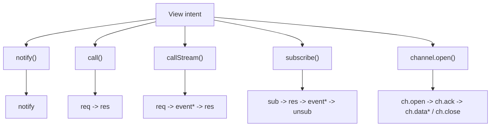
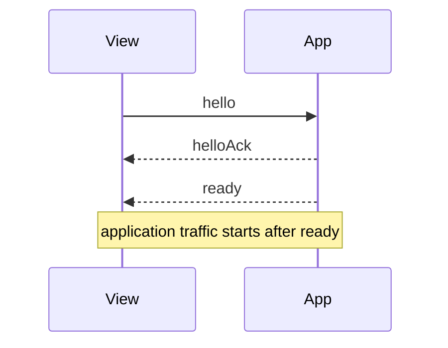
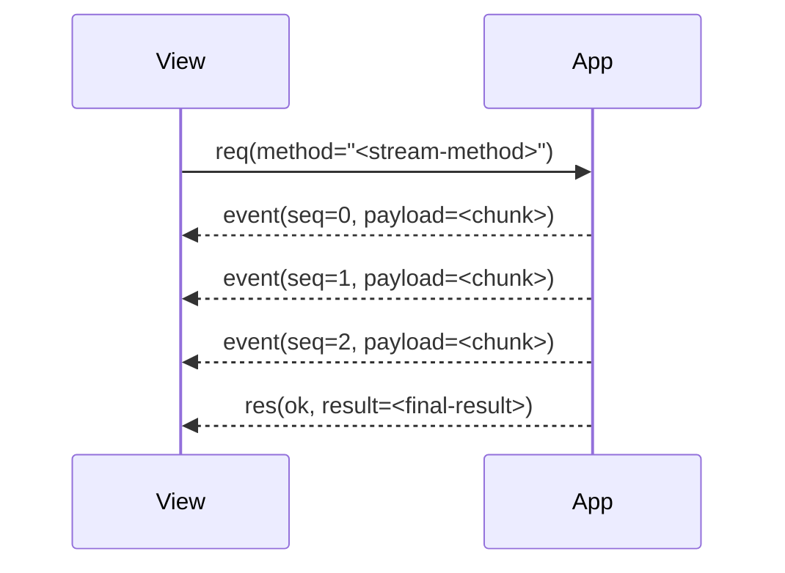
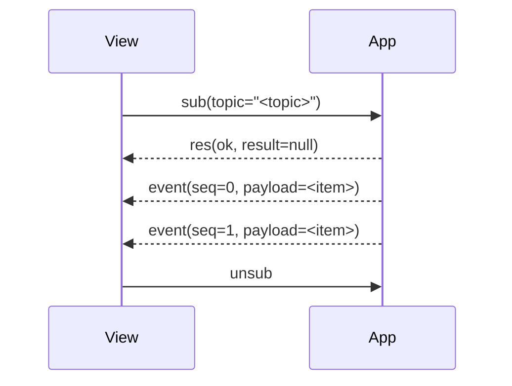
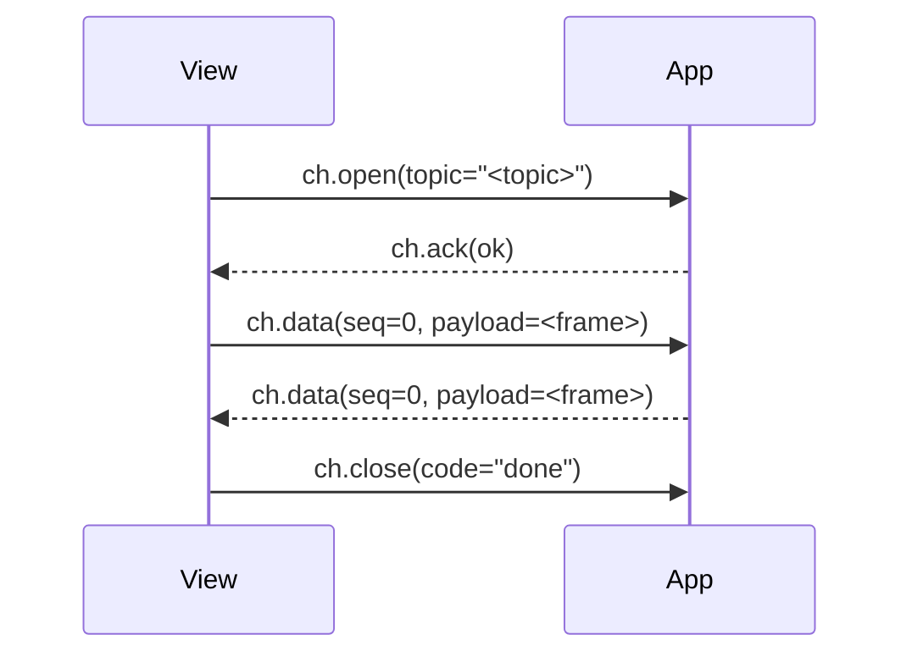

# LingXia Bridge Protocol

> Status: Active
> Class: Normative internal specification
> Scope: app bridge endpoint <-> `window.LingXiaBridge`
> Version: protocol `v = 2`

This document defines the current LingXia bridge contract. It is the single authority for on-wire behavior between the View runtime and the app-side bridge endpoint. When other notes, drafts, or implementation comments disagree with this document, this document wins.

The key words MUST, MUST NOT, SHOULD, SHOULD NOT, and MAY are to be interpreted as normative requirements.

## 1. Purpose

The bridge provides a single transport contract for:

- session establishment
- request/response RPC
- request streaming
- topic subscriptions
- bidirectional channels
- page state replication
- capability validation

The bridge does not define:

- host capability semantics
- business orchestration
- UI rendering behavior
- transport details beyond ordered bidirectional delivery

## 2. Topology

The bridge boundary is between the View runtime and an app-side endpoint owned by Rust.

Current repository profile:

- the bridge-facing handler implementation is `PageSvc`
- Host-backed unary `req` / `notify` are routed through that endpoint
- Rust may initiate direct `req` / `res` exchanges with View-owned handlers
- subscription and channel handling are currently `PageSvc`-owned

```mermaid
flowchart LR
  Host["Rust Host\nplatform + native capability"]
  App["App bridge endpoint\nRust-owned protocol peer"]
  JS["PageSvc / Logic JS\ncurrent bridge-facing handler"]
  View["View runtime\nwindow.LingXiaBridge"]

  Host --> App
  App --> JS
  View <--> App

  App -. state.snapshot / state.patch .-> View
  App -. event / res / ch.data / ch.close .-> View
  App -. req / res .-> View
```

### 2.1 Runtime Roles

| Role | Responsibility |
|---|---|
| Rust Host | native capabilities, platform integration, process boundaries |
| App bridge endpoint | protocol ownership, validation, routing, lifecycle, direct View calls |
| PageSvc / Logic JS | current bridge-facing handler for page state, subscriptions, channels, and JS-owned methods |
| View | rendering, user interaction, stream consumption |

### 2.2 Authority Boundary

- The app bridge endpoint is authoritative for protocol validation and routing.
- In the current implementation, state replication, subscriptions, and channels are produced by `PageSvc`.
- View is authoritative for user interaction and channel-originated input.
- The protocol does not require JS to sit between Rust and View.

## 3. Protocol Overview

### 3.1 Interaction Families

| Family | Initiator API | Frame pattern | Cardinality |
|---|---|---|---|
| Notification | `notify()` | `notify` | one-way |
| Unary request | `call()` | `req -> res` | one terminal response |
| Streaming request | `callStream()` | `req -> event* -> res` | zero or more events, one terminal response |
| Subscription | `subscribe()` | `sub -> res -> event* -> unsub` | long-lived stream |
| Channel | `channel.open()` | `ch.open -> ch.ack -> ch.data* / ch.close` | long-lived bidirectional session |
| State replication | `state.subscribe()` | `state.snapshot` / `state.patch` / `state.ack` | app -> View only |



### 3.2 Symmetry

`req`/`res` is the only symmetric request family in the protocol.

- View -> app bridge endpoint supports unary and streaming request handling.
- app bridge endpoint -> View currently supports unary request handling for View-owned handlers.

Subscriptions, channels, and state replication are currently defined from the View-facing API surface described in this document.

## 4. Common Wire Rules

### 4.1 Version

All frames in this specification use protocol version `2`.

### 4.2 Envelope

Every frame MUST include:

- `v`: protocol version
- `kind`: frame kind

Frames are JSON objects transported over an ordered bidirectional message path.

### 4.3 Identifiers

- `id` is opaque to the receiver.
- `id` MUST be unique within the sender's active operation set.
- `id` reuse before terminal completion is invalid.

### 4.4 Ordering

- `seq` is monotonic per request stream, per subscription, or per channel direction.
- `seq` begins at `0`.
- Receivers MUST tolerate already-in-flight frames arriving after `cancel`, `unsub`, or `ch.close`.

### 4.5 Capability Derivation

Frames `req`, `notify`, `sub`, and `ch.open` MUST include `cap`.

Capability is derived from the target name:

| Name pattern | Derived capability |
|---|---|
| `host.*` | `host` |
| `state.*` | `state` |
| `xxx.yyy` | `xxx` |
| no dot | `page` |

If the declared capability does not match the derived capability, the receiver MUST reject the frame.

## 5. Session Establishment

Application traffic begins only after a successful handshake.

| Step | Direction | Purpose |
|---|---|---|
| `hello` | View -> app bridge endpoint | advertise supported versions |
| `helloAck` | app bridge endpoint -> View | confirm negotiated version and session id |
| `ready` | app bridge endpoint -> View | open application traffic |



### 5.1 `hello`

```json
{
  "v": 2,
  "kind": "hello",
  "nonce": "<nonce>",
  "role": "view",
  "protocolsSupported": [2]
}
```

### 5.2 `helloAck`

```json
{
  "v": 2,
  "kind": "helloAck",
  "nonce": "<nonce>",
  "protocol": 2,
  "sessionId": "<session-id>"
}
```

### 5.3 `ready`

```json
{
  "v": 2,
  "kind": "ready",
  "sessionId": "<session-id>"
}
```

### 5.4 Pre-ready Behavior

Before `ready`, non-handshake traffic MUST be rejected or queued by runtime policy.

Current LingXia profile:

- View queues outbound application frames.
- queued operation timeouts begin when a frame is actually sent, not while it is waiting behind handshake readiness
- The app bridge endpoint rejects premature frames with `BRIDGE_NOT_READY`.

## 6. Frame Definitions

### 6.1 `req`

Starts a unary or streaming request.

```json
{
  "v": 2,
  "kind": "req",
  "id": "<req-id>",
  "method": "<method>",
  "params": {},
  "cap": "page"
}
```

### 6.2 `res`

Terminal response for `req` or `sub`.

Success:

```json
{
  "v": 2,
  "kind": "res",
  "id": "<id>",
  "ok": true,
  "result": {}
}
```

Failure:

```json
{
  "v": 2,
  "kind": "res",
  "id": "<id>",
  "ok": false,
  "error": {
    "code": "BRIDGE_INTERNAL_ERROR",
    "message": "..."
  }
}
```

Rules:

- `res` is terminal for `req`.
- For `sub`, `res` is terminal only for the establishment phase.
- After request-terminal `res`, no more `event` frames may be emitted for that request id.
- Successful subscription establishment is acknowledged as `res { ok: true, result: null }`.

### 6.3 `notify`

One-way invocation with no terminal response.

```json
{
  "v": 2,
  "kind": "notify",
  "method": "<method>",
  "params": {},
  "cap": "page"
}
```

### 6.4 `cancel`

Best-effort cancellation of an active request.

```json
{
  "v": 2,
  "kind": "cancel",
  "id": "<req-id>"
}
```

The initiator SHOULD still expect a terminal `res`, commonly `BRIDGE_CANCELED`.

### 6.5 `event`

Streaming payload bound to a request or subscription.

```json
{
  "v": 2,
  "kind": "event",
  "id": "<req-or-sub-id>",
  "seq": 0,
  "payload": {}
}
```

Rules:

- `event` is valid only after request dispatch or successful subscription acknowledgement and before `sub.close`.
- `seq` MUST be monotonic per `id`.
- `event` carries transient transport data, not durable replicated state.

### 6.6 `sub`

Starts a subscription.

```json
{
  "v": 2,
  "kind": "sub",
  "id": "<sub-id>",
  "topic": "<topic>",
  "params": {},
  "cap": "page"
}
```

### 6.7 `unsub`

Stops a subscription.

```json
{
  "v": 2,
  "kind": "unsub",
  "id": "<sub-id>"
}
```

`unsub` is idempotent.

### 6.8 `sub.close`

Terminal subscription closure notification.

Success / normal completion:

```json
{
  "v": 2,
  "kind": "sub.close",
  "id": "<sub-id>"
}
```

Failure:

```json
{
  "v": 2,
  "kind": "sub.close",
  "id": "<sub-id>",
  "error": {
    "code": "BRIDGE_INTERNAL_ERROR",
    "message": "..."
  }
}
```

Rules:

- `sub.close` is app bridge endpoint -> View only.
- After `sub.close`, no more `event` frames may be emitted for that subscription id.
- If `error` is present, the View runtime MUST deliver it to subscription error listeners and retire the subscription locally.

### 6.9 `ch.open`

Opens a bidirectional channel.

```json
{
  "v": 2,
  "kind": "ch.open",
  "id": "<channel-id>",
  "topic": "<topic>",
  "params": {},
  "cap": "page"
}
```

### 6.10 `ch.ack`

Acknowledges channel establishment.

```json
{
  "v": 2,
  "kind": "ch.ack",
  "id": "<channel-id>",
  "ok": true
}
```

### 6.11 `ch.data`

Carries channel payload.

```json
{
  "v": 2,
  "kind": "ch.data",
  "id": "<channel-id>",
  "seq": 0,
  "payload": {}
}
```

### 6.12 `ch.close`

Closes a channel.

```json
{
  "v": 2,
  "kind": "ch.close",
  "id": "<channel-id>",
  "code": "done",
  "reason": "optional"
}
```

Rules:

- `ch.ack` completes channel establishment.
- `seq` is monotonic per direction per channel.
- After sending `ch.close`, the sender MUST stop sending `ch.data` for that id.

### 6.13 `state.snapshot`

Full replicated state snapshot.

```json
{
  "v": 2,
  "kind": "state.snapshot",
  "scope": "page",
  "rev": 1,
  "state": {}
}
```

### 6.14 `state.patch`

Incremental state update.

```json
{
  "v": 2,
  "kind": "state.patch",
  "scope": "page",
  "baseRev": 1,
  "rev": 2,
  "ops": [],
  "ack": true
}
```

### 6.15 `state.ack`

Acknowledges a replicated revision.

```json
{
  "v": 2,
  "kind": "state.ack",
  "scope": "page",
  "rev": 2
}
```

State replication is app bridge endpoint -> View only.

Use state replication for durable, recoverable UI state. Use `event` and `ch.data` for transient or high-frequency payloads.

## 7. Reference Exchanges

This section is illustrative. It describes protocol shapes, not business-level contracts.

### 7.1 Streaming Request



### 7.2 Subscription



### 7.3 Channel



## 8. Error Codes

Bridge-level error codes are stable.

| Code | Meaning |
|---|---|
| `BRIDGE_NOT_READY` | handshake not complete |
| `BRIDGE_TIMEOUT` | request timed out |
| `BRIDGE_CANCELED` | request or stream canceled |
| `BRIDGE_PROTOCOL_MISMATCH` | unsupported protocol version |
| `BRIDGE_HANDSHAKE_FAILED` | handshake failed |
| `BRIDGE_MALFORMED_MESSAGE` | invalid frame |
| `BRIDGE_METHOD_NOT_FOUND` | request method missing |
| `BRIDGE_TOPIC_NOT_FOUND` | subscription or channel topic missing |
| `BRIDGE_CAPABILITY_DENIED` | capability denied |
| `BRIDGE_INTERNAL_ERROR` | unexpected internal error |
| `BRIDGE_OUTBOX_FULL` | sender outbox overflow |
| `BRIDGE_STREAM_OVERFLOW` | stream buffer overflow |
| `BRIDGE_STREAM_CLOSED` | operation on a closed stream or channel |

## 9. API Surface Mapping

### 9.1 View Runtime

The View runtime exposes:

```ts
LingXiaBridge.call(method, params?, options?): Promise<result>
LingXiaBridge.callStream(method, params?, options?): StreamHandle<data, result>
LingXiaBridge.notify(method, params?, options?): void
LingXiaBridge.subscribe(topic, params?, options?): Promise<Subscription<data>>
LingXiaBridge.channel.open(topic, params?, options?): Promise<Channel<data>>
LingXiaBridge.state.subscribe((data, info) => void): () => void
```

### 9.2 Generated Page Actions

The CLI maps JS method shape to View wrapper behavior:

| JS method shape | Generated View behavior |
|---|---|
| `void` or `Promise<void>` | `notify()` |
| non-void return | `call()` |
| `async function*`, `AsyncIterable`, `AsyncIterator`, `AsyncGenerator` | `callStream()` |

### 9.3 PageSvc Implementation Profile

The current repository profile supports the following `PageSvc`-backed contracts:

- unary methods returning a value
- streaming methods returning an async iterator or async generator
- subscription targets returning an async iterator
- channel targets receiving `(params, channel)` and optionally returning `{ onData, onClose }`

This is the current implementation profile. Direct Rust-native handlers for subscriptions or channels are not part of the shipped runtime path described here.

## 10. Adoption Rule

Only the current v2 surface is supported:

- `LingXiaBridge.subscribe(...)` is reserved for topic subscriptions
- `LingXiaBridge.state.subscribe(...)` is the only state subscription API
- generated page wrappers target the current API surface only
- no compatibility alias or parallel legacy specification is maintained
