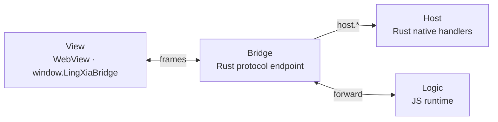
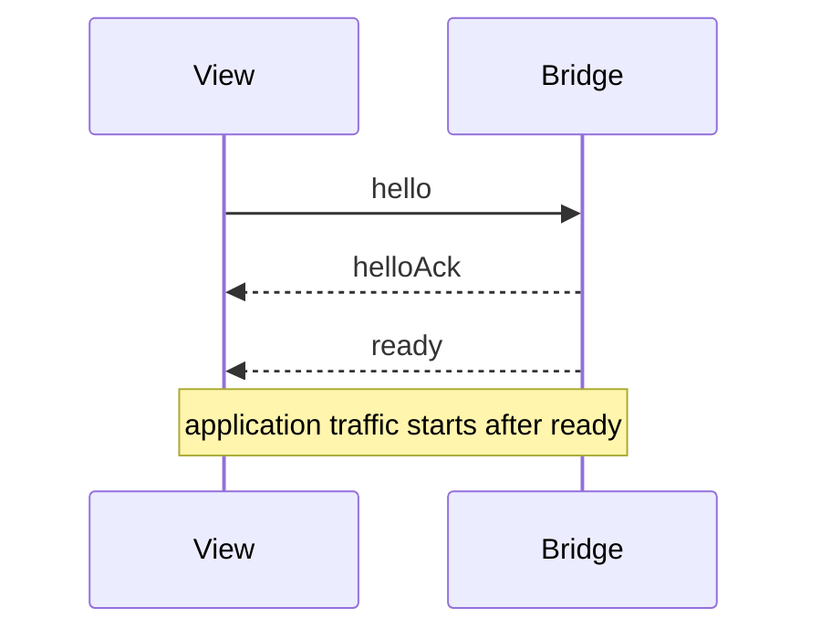
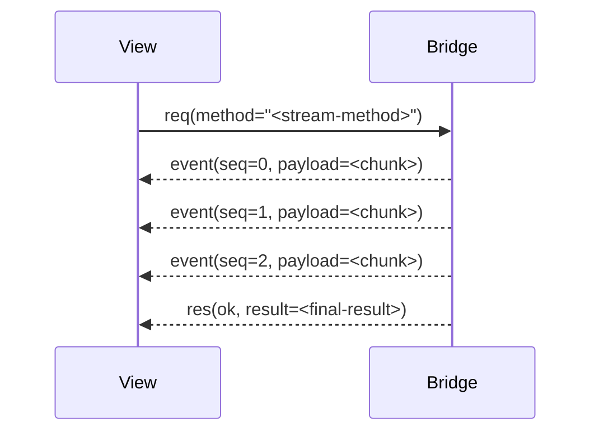
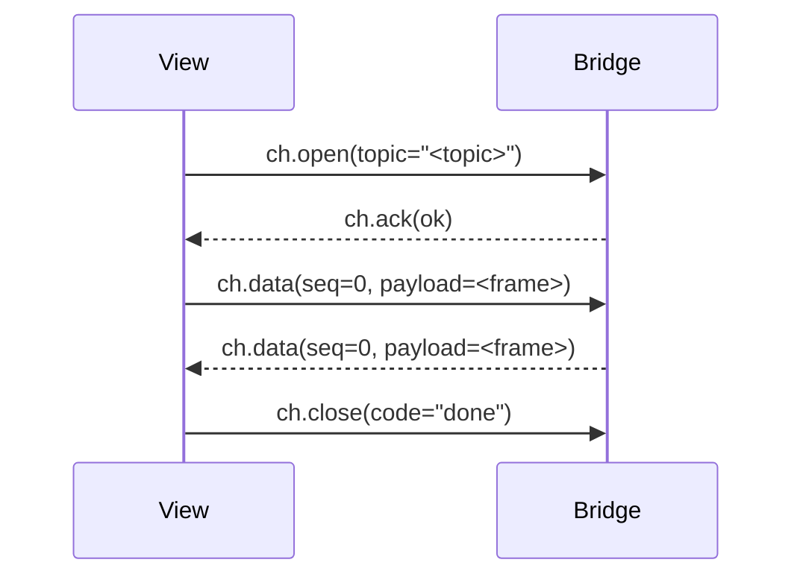
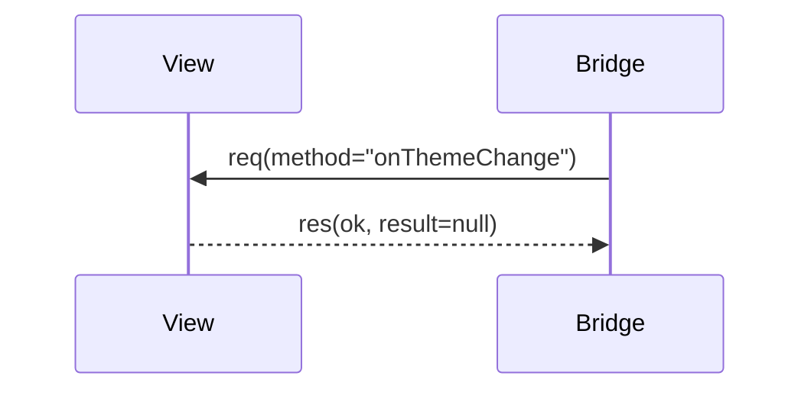
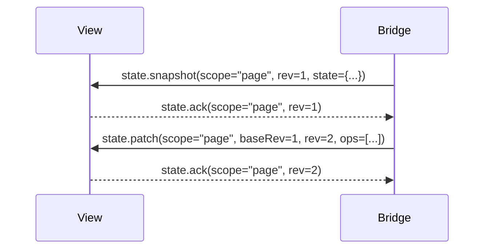
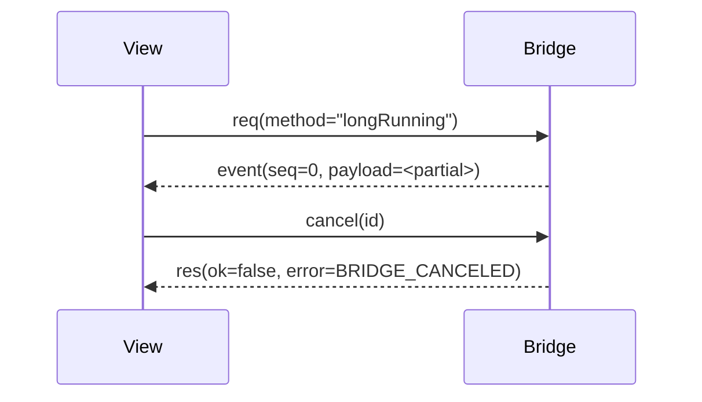

# LingXia Bridge Protocol

> Status: Active
> Class: Normative internal specification
> Scope: Bridge (Rust) <-> View (`window.LingXiaBridge`)
> Version: protocol `v = 2`

This document defines the current LingXia bridge contract. It is the single authority for on-wire behavior between the View runtime and the Bridge endpoint. When other notes, drafts, or implementation comments disagree with this document, this document wins.

The key words MUST, MUST NOT, SHOULD, SHOULD NOT, and MAY are to be interpreted as normative requirements.

## 1. Purpose

The bridge provides a single transport contract for:

- session establishment
- request/response RPC
- request streaming
- topic subscriptions
- bidirectional channels
- page state replication
- capability validation

The bridge does not define:

- host capability semantics
- business orchestration
- UI rendering behavior
- transport details beyond ordered bidirectional delivery

## 2. Topology



**Bridge** is the Rust-owned protocol endpoint. It validates frames, enforces capabilities, and routes messages between View and two backends:

- **Host** — Rust native handlers (device, navigation, etc.). Bridge dispatches `host.*` methods directly.
- **Logic** — JS runtime. Bridge forwards all other methods and channels.

Routing rules:

- `host.*` methods → Host registry (unary `req` and `notify` only)
- all other `req`, `notify`, `ch.open` → Logic
- Bridge MAY initiate `req` to View-owned handlers (see 3.2)
- state replication is produced by Logic and relayed through Bridge to View

### 2.1 Runtime Roles

| Role | Responsibility |
|---|---|
| Host | native capabilities, platform integration, process boundaries |
| Bridge | protocol ownership, validation, routing, lifecycle, direct View calls |
| Logic | page state, subscriptions, channels, JS-owned methods |
| View | rendering, user interaction, stream consumption |

### 2.2 Authority Boundary

- Bridge is authoritative for protocol validation and routing.
- State replication, subscriptions, and channels are produced by Logic.
- View is authoritative for user interaction and channel-originated input.
- The protocol does not require JS to sit between Host and View; Host handlers MAY produce streams and responses directly.

## 3. Protocol Overview

### 3.1 View-initiated Families

| Family | Initiator API | Frame pattern | Cardinality |
|---|---|---|---|
| Notification | `notify()` | `notify` | one-way, no response |
| Unary request | `call()` | `req -> res` | one terminal response |
| Streaming request | `callStream()` | `req -> event* -> res` | zero or more events, one terminal response |
| Channel | `channel.open()` | `ch.open -> ch.ack -> ch.data* / ch.close` | long-lived bidirectional session |

### 3.2 Bridge-initiated Families

| Family | Frame pattern | Description |
|---|---|---|
| Unary request | `req -> res` | Bridge calls a View-owned handler |
| State replication | `state.snapshot` / `state.patch` / `state.ack` | Bridge pushes durable UI state to View |

`req`/`res` is the only symmetric family — both sides can initiate. Bridge-initiated `req` uses the same frame format as View-initiated requests.

State replication is exclusively Bridge -> View. View registers a callback via `state.subscribe()` and receives snapshots and patches without sending requests.

### 3.3 Data Flow Direction

Although streaming requests are View-initiated, the **data flows from Bridge to View**. View establishes the session; Bridge controls when and what to push.

| Family | Who initiates | Who pushes data | Who terminates |
|---|---|---|---|
| Notification | View | — | — |
| Unary request | either side | responder | responder (`res`) |
| Streaming request | View | Bridge (`event*`) | Bridge (`res`) |
| Channel | View (`ch.open`) | both (`ch.data`) | either (`ch.close`) |
| State replication | Bridge | Bridge | — (persistent) |

## 4. Common Wire Rules

### 4.1 Version

All frames in this specification use protocol version `2`.

### 4.2 Envelope

Every frame MUST include:

- `v`: protocol version
- `kind`: frame kind

Frames are JSON objects transported over an ordered bidirectional message path.

### 4.3 Identifiers

- `id` is opaque to the receiver.
- `id` MUST be unique within the sender's active operation set.
- `id` reuse before terminal completion is invalid.

### 4.4 Ordering

- `seq` is monotonic per request stream or per channel direction.
- `seq` begins at `0`.
- Receivers MUST tolerate already-in-flight frames arriving after `cancel` or `ch.close`.

### 4.5 Capability Derivation

Frames `req`, `notify`, and `ch.open` MUST include `cap`.

Capability is derived from the target name (`method` for `req`/`notify`, `topic` for `sub`/`ch.open`):

| Name pattern | Derived capability |
|---|---|
| `host.*` | `host` |
| `state.*` | `state` |
| `xxx.yyy` | `xxx` |
| no dot | `page` |

If the declared capability does not match the derived capability, the receiver MUST reject the frame.

## 5. Session Establishment

Application traffic begins only after a successful handshake.

| Step | Direction | Purpose |
|---|---|---|
| `hello` | View -> Bridge | advertise supported versions |
| `helloAck` | Bridge -> View | confirm negotiated version and session id |
| `ready` | Bridge -> View | open application traffic |



### 5.1 `hello`

```json
{
  "v": 2,
  "kind": "hello",
  "nonce": "<nonce>",
  "role": "view",
  "protocolsSupported": [2]
}
```

### 5.2 `helloAck`

```json
{
  "v": 2,
  "kind": "helloAck",
  "nonce": "<nonce>",
  "protocol": 2,
  "sessionId": "<session-id>"
}
```

### 5.3 `ready`

```json
{
  "v": 2,
  "kind": "ready",
  "sessionId": "<session-id>"
}
```

### 5.4 Pre-ready Behavior

Before `ready`, non-handshake traffic MUST be rejected or queued by runtime policy.

LingXia profile:

- View MUST queue outbound application frames until `ready` is received.
- Queued operation timeouts begin when the frame is actually sent, not while queued.
- Bridge MUST reject premature frames with `BRIDGE_NOT_READY`.

## 6. Frame Definitions

### 6.1 `req`

Direction: View -> Bridge, or Bridge -> View (symmetric).

Starts a unary or streaming request.

```json
{
  "v": 2,
  "kind": "req",
  "id": "<req-id>",
  "method": "<method>",
  "params": {},
  "cap": "page"
}
```

- `params` is optional. If absent or `null`, the handler receives no input.
- `cap` is required for View -> Bridge. Bridge -> View requests MAY omit `cap`.

### 6.2 `res`

Direction: responder -> initiator (symmetric, matches `req` direction).

Terminal response for `req`. Also used to acknowledge `sub` establishment.

Success:

```json
{
  "v": 2,
  "kind": "res",
  "id": "<id>",
  "ok": true,
  "result": {}
}
```

Failure:

```json
{
  "v": 2,
  "kind": "res",
  "id": "<id>",
  "ok": false,
  "error": {
    "code": "BRIDGE_INTERNAL_ERROR",
    "message": "..."
  }
}
```

Rules:

- `res` is terminal for `req`.
- For `sub`, `res` is terminal only for the establishment phase.
- After request-terminal `res`, no more `event` frames may be emitted for that request id.
- Successful subscription establishment is acknowledged as `res { ok: true, result: null }`.

### 6.3 `notify`

Direction: View -> Bridge.

One-way invocation. No response is produced.

```json
{
  "v": 2,
  "kind": "notify",
  "method": "<method>",
  "params": {},
  "cap": "page"
}
```

- `params` is optional.

### 6.4 `cancel`

Direction: initiator -> responder (same direction as the original `req`).

Best-effort cancellation of an active request.

```json
{
  "v": 2,
  "kind": "cancel",
  "id": "<req-id>"
}
```

The initiator SHOULD still expect a terminal `res`, commonly `BRIDGE_CANCELED`.

### 6.5 `event`

Direction: Bridge -> View (for streaming requests and subscriptions).

Streaming payload bound to a request or subscription.

```json
{
  "v": 2,
  "kind": "event",
  "id": "<req-or-sub-id>",
  "seq": 0,
  "payload": {}
}
```

Rules:

- For streaming requests: `event` is valid after `req` dispatch and before terminal `res`.
- For subscriptions: `event` is valid after `res { ok: true }` acknowledgement and before `sub.close`.
- `seq` MUST be monotonic per `id`, starting at `0`.
- `event` carries transient transport data, not durable replicated state. Use `state.patch` for durable state.

### 6.6 `ch.open`

Direction: View -> Bridge.

Opens a bidirectional channel.

```json
{
  "v": 2,
  "kind": "ch.open",
  "id": "<channel-id>",
  "topic": "<topic>",
  "params": {},
  "cap": "page"
}
```

- `params` is optional.

### 6.7 `ch.ack`

Direction: Bridge -> View.

Acknowledges or rejects channel establishment.

Success:

```json
{
  "v": 2,
  "kind": "ch.ack",
  "id": "<channel-id>",
  "ok": true
}
```

Failure:

```json
{
  "v": 2,
  "kind": "ch.ack",
  "id": "<channel-id>",
  "ok": false,
  "error": {
    "code": "BRIDGE_TOPIC_NOT_FOUND",
    "message": "..."
  }
}
```

- If `ok` is `false`, the channel is not established. No `ch.data` or `ch.close` frames are valid for this `id`.

### 6.8 `ch.data`

Direction: bidirectional (View <-> Bridge).

Carries channel payload.

```json
{
  "v": 2,
  "kind": "ch.data",
  "id": "<channel-id>",
  "seq": 0,
  "payload": {}
}
```

### 6.9 `ch.close`

Direction: bidirectional (either side MAY close).

Closes a channel.

```json
{
  "v": 2,
  "kind": "ch.close",
  "id": "<channel-id>",
  "code": "done",
  "reason": "optional"
}
```

Rules:

- `ch.ack` completes channel establishment.
- `seq` is monotonic per direction per channel.
- After sending `ch.close`, the sender MUST stop sending `ch.data` for that id.

### 6.10 `state.snapshot`

Direction: Bridge -> View.

Full replicated state snapshot.

```json
{
  "v": 2,
  "kind": "state.snapshot",
  "scope": "page",
  "rev": 1,
  "state": {}
}
```

### 6.11 `state.patch`

Direction: Bridge -> View.

Incremental state update.

```json
{
  "v": 2,
  "kind": "state.patch",
  "scope": "page",
  "baseRev": 1,
  "rev": 2,
  "ops": [],
  "ack": true
}
```

### 6.12 `state.ack`

Direction: View -> Bridge.

Acknowledges a replicated revision.

```json
{
  "v": 2,
  "kind": "state.ack",
  "scope": "page",
  "rev": 2
}
```

Use state replication for durable, recoverable UI state. Use `event` and `ch.data` for transient or high-frequency payloads.

## 7. Reference Exchanges

This section is illustrative. It describes protocol shapes, not business-level contracts.

### 7.1 Streaming Request



### 7.2 Channel



### 7.3 Bridge-initiated Request



### 7.4 State Replication



### 7.5 Request Cancellation



## 8. Error Codes

Bridge-level error codes are part of the protocol contract and MUST NOT be removed or have their semantics redefined.

| Code | Meaning |
|---|---|
| `BRIDGE_NOT_READY` | handshake not complete |
| `BRIDGE_TIMEOUT` | request timed out |
| `BRIDGE_CANCELED` | request or stream canceled |
| `BRIDGE_PROTOCOL_MISMATCH` | unsupported protocol version |
| `BRIDGE_HANDSHAKE_FAILED` | handshake failed |
| `BRIDGE_MALFORMED_MESSAGE` | invalid frame |
| `BRIDGE_METHOD_NOT_FOUND` | request method missing |
| `BRIDGE_TOPIC_NOT_FOUND` | channel topic missing |
| `BRIDGE_CAPABILITY_DENIED` | capability denied |
| `BRIDGE_INTERNAL_ERROR` | unexpected internal error |
| `BRIDGE_OUTBOX_FULL` | sender outbox overflow |
| `BRIDGE_STREAM_OVERFLOW` | stream buffer overflow |
| `BRIDGE_STREAM_CLOSED` | operation on a closed stream or channel |

## 9. API Surface Mapping

### 9.1 View Runtime

The View runtime exposes:

```ts
LingXiaBridge.call(method, params?, options?): Promise<result>
LingXiaBridge.callStream(method, params?, options?): StreamHandle<data, result>
LingXiaBridge.notify(method, params?, options?): void
LingXiaBridge.channel.open(topic, params?, options?): Promise<Channel<data>>
LingXiaBridge.state.subscribe((data, info) => void): () => void
```

### 9.2 Generated Page Actions

The CLI maps JS method shape to View wrapper behavior:

| JS method shape | Generated View behavior |
|---|---|
| `void` or `Promise<void>` | `notify()` |
| non-void return | `call()` |
| `async function*`, `AsyncIterable`, `AsyncIterator`, `AsyncGenerator` | `callStream()` |

### 9.3 Backend Capabilities

| Backend | `req` | `notify` | `ch.open` |
|---|---|---|---|
| Host | unary and streaming | yes | — |
| Logic | unary and streaming | yes | yes |

