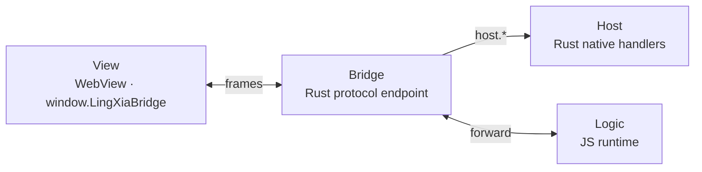
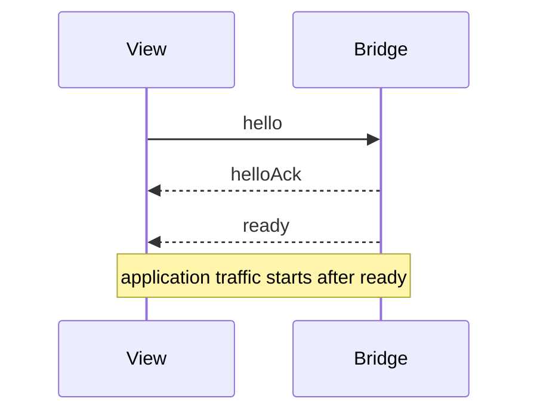
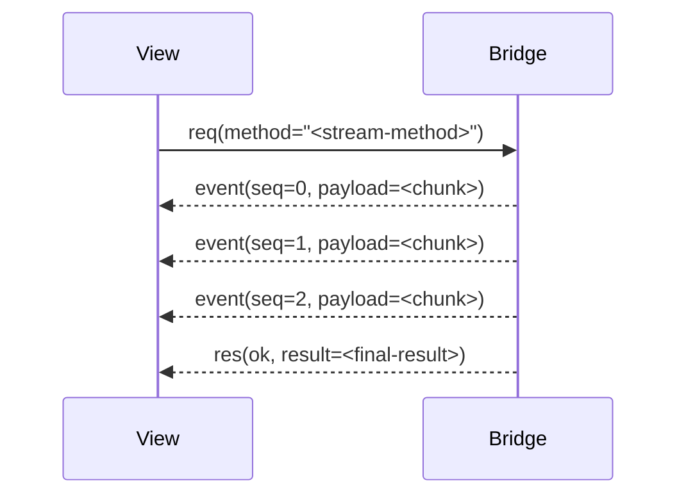
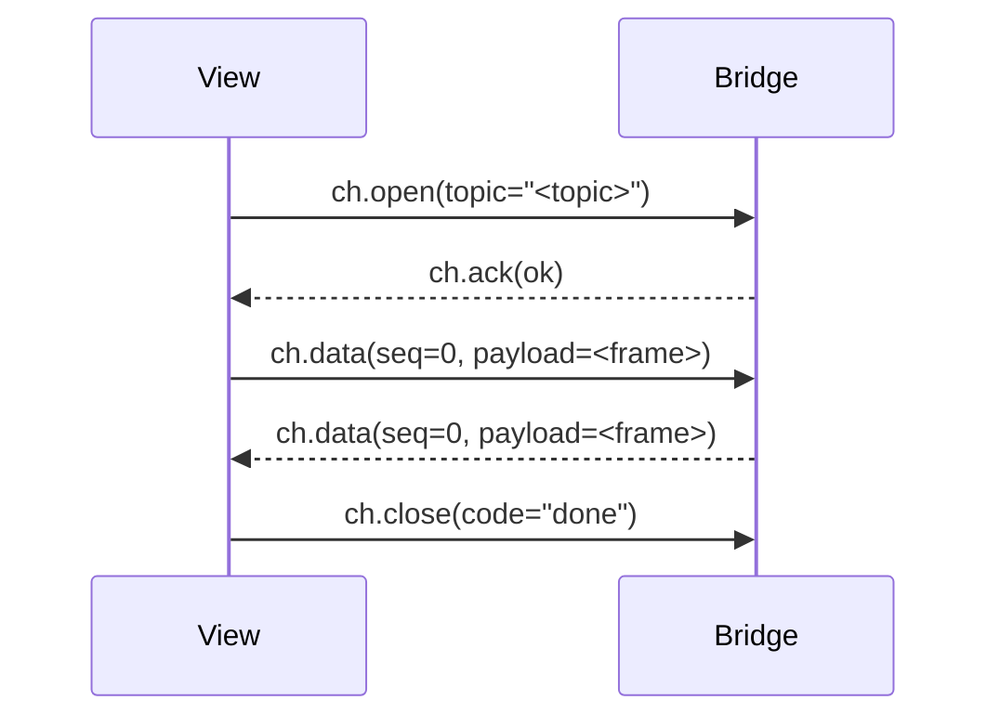
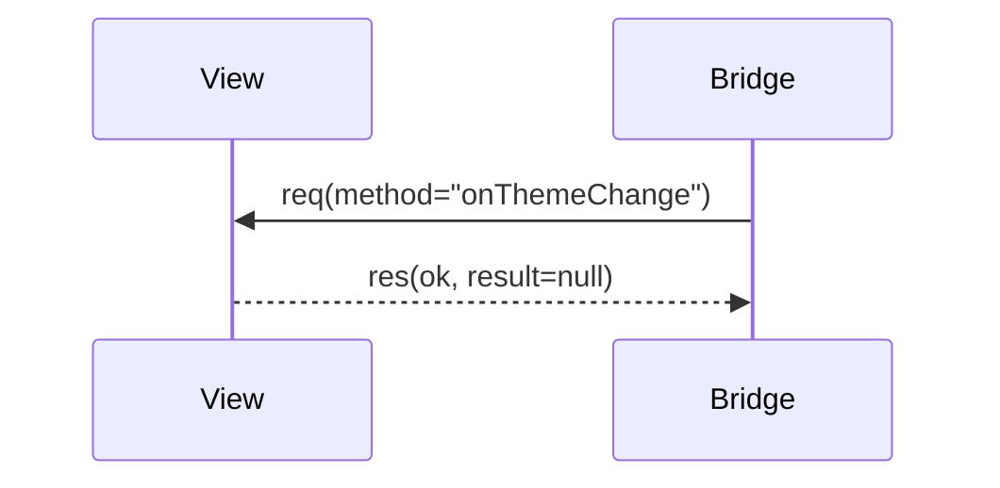
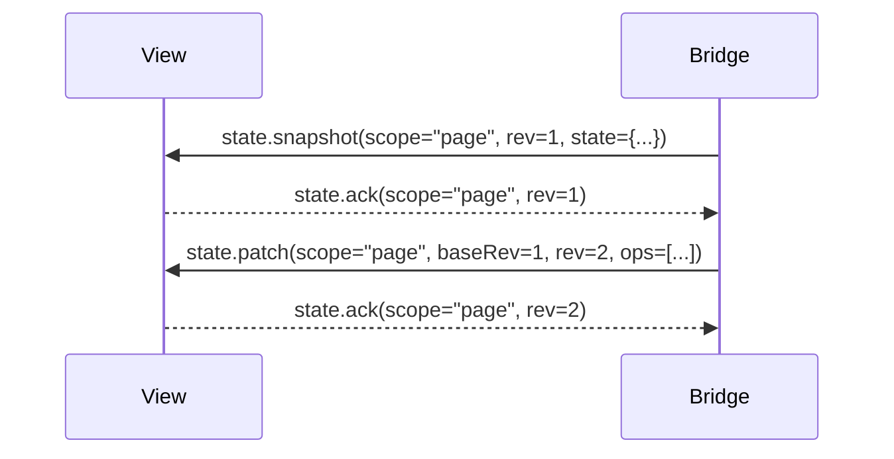
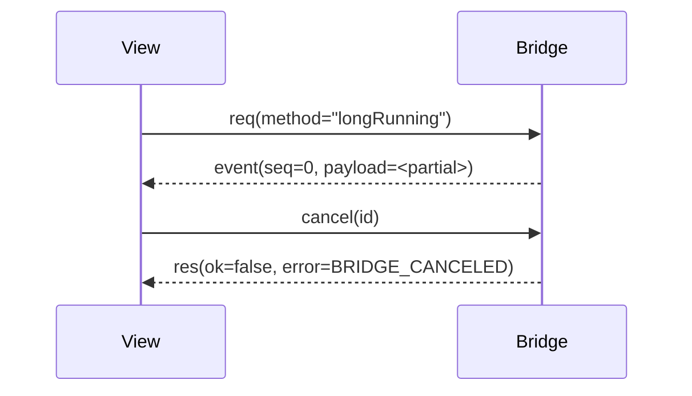

# LingXia Bridge Protocol

> **Audience**: contributors working on bridge implementations (`crates/lingxia-bridge`, `packages/lingxia-bridge`) or other transport endpoints. If you're **building an app on LingXia**, the bridge surface you actually use (`setData`, stream, channel — `useLxPage` / `useLxStream` / `useLxChannel`) is documented in the skill at [`docs/skill/lxapp/bridge.md`](../skill/lxapp/bridge.md) — start there. App code never constructs wire frames directly; this doc only matters when implementing or modifying the transport itself.

> Status: Active
> Class: Normative internal specification
> Scope: Bridge (Rust) <-> View (`window.LingXiaBridge`)
> Versions: `LegacyV2`（`v = 2`）与 document-bound `RequiredV3`（`v = 3`）

This document defines the current LingXia bridge contract. It is the single authority for on-wire behavior between the View runtime and the Bridge endpoint. When other notes, drafts, or implementation comments disagree with this document, this document wins.

The key words MUST, MUST NOT, SHOULD, SHOULD NOT, and MAY are to be interpreted as normative requirements.

## 1. Purpose

The bridge provides a single transport contract for:

- session establishment
- request/response RPC
- request streaming
- topic subscriptions
- bidirectional channels
- page state replication
- capability validation

The bridge does not define:

- host capability semantics
- business orchestration
- UI rendering behavior
- transport details beyond ordered bidirectional delivery

## 2. Topology


```mermaid
flowchart LR
  View["View\nWebView · window.LingXiaBridge"]
  Bridge["Bridge\nRust protocol endpoint"]
  Host["Host\nRust native handlers"]
  Logic["Logic\nJS runtime"]

  View <-->|frames| Bridge
  Bridge -->|"host.*"| Host
  Bridge <-->|forward| Logic
```

**Bridge** is the Rust-owned protocol endpoint. It validates frames, enforces capabilities, and routes messages between View and two backends:

- **Host** — Rust native handlers (device, navigation, etc.). Bridge dispatches `host.*` methods directly.
- **Logic** — JS runtime. Bridge forwards all other methods and channels.

Routing rules:

- `host.*` methods → Host registry (unary `req` and `notify` only)
- all other `req`, `notify`, `ch.open` → Logic
- Bridge MAY initiate `req` to View-owned handlers (see 3.2)
- state replication is produced by Logic and relayed through Bridge to View

### 2.1 Runtime Roles

| Role | Responsibility |
|---|---|
| Host | native capabilities, platform integration, process boundaries |
| Bridge | protocol ownership, validation, routing, lifecycle, direct View calls |
| Logic | page state, subscriptions, channels, JS-owned methods |
| View | rendering, user interaction, stream consumption |

### 2.2 Authority Boundary

- Bridge is authoritative for protocol validation and routing.
- State replication, subscriptions, and channels are produced by Logic.
- View is authoritative for user interaction and channel-originated input.
- The protocol does not require JS to sit between Host and View; Host handlers MAY produce streams and responses directly.

### 2.3 连接 profile

LingXia 有两个由 native 选择的 protocol profile；page 不能自行选择或向下协商：

| Profile | 使用方 | Native 选择方式 | Authority 模型 |
|---|---|---|---|
| `LegacyV2` | ordinary lxapp View document | 不安装 control bootstrap | app-session identity 由 native page owner 提供；wire frame 不是 document credential |
| `RequiredV3` | host-attested browser control document | native bootstrap 为一个已 commit document 固定 `requiredProtocol: 3` | 每个 frame 都绑定该 document 的 active `DocumentSession` |

`hello` 中的 `role` 只描述 protocol endpoint（`view`），既不是 `CallerClass`，也不是
`RouteAudience`。Native 从 owning app session 或 active browser `DocumentSession` 派生 caller
identity；route registry 再将该 identity 与 route 的固定 audience 比较。`appid`、URL、`role`、
`cap` 与 payload field 都不得提升 caller 权限。

ordinary page 保持 `LegacyV2`；同一进程中存在 V3 support 不会自动升级它。browser control
document 保持 `RequiredV3`；缺失、malformed、V2 或 future-version bootstrap/traffic 都不能使它
降级为 V2。

## 3. Protocol Overview

### 3.1 View-initiated Families

| Family | Low-level API | Frame pattern | Cardinality |
|---|---|---|---|
| Notification | `raw.notify()` | `notify` | one-way, no response |
| Unary request | `raw.call()` | `req -> res` | one terminal response |
| Streaming request | `raw.stream()` | `req -> event* -> res` | zero or more events, one terminal response |
| Channel | `raw.channel.open()` | `ch.open -> ch.ack -> ch.data* / ch.close` | long-lived bidirectional session |

### 3.2 Bridge-initiated Families

| Family | Frame pattern | Description |
|---|---|---|
| Unary request | `req -> res` | Bridge calls a View-owned handler |
| State replication | `state.snapshot` / `state.patch` / `state.ack` | Bridge pushes durable UI state to View |

`req`/`res` is the only symmetric family — both sides can initiate. Bridge-initiated `req` uses the same frame format as View-initiated requests.

State replication is exclusively Bridge -> View. View registers a callback via `state.subscribe()` and receives snapshots and patches without sending requests.

### 3.3 Data Flow Direction

Although streaming requests are View-initiated, the **data flows from Bridge to View**. View establishes the session; Bridge controls when and what to push.

| Family | Who initiates | Who pushes data | Who terminates |
|---|---|---|---|
| Notification | View | — | — |
| Unary request | either side | responder | responder (`res`) |
| Streaming request | View | Bridge (`event*`) | Bridge (`res`) |
| Channel | View (`ch.open`) | both (`ch.data`) | either (`ch.close`) |
| State replication | Bridge | Bridge | — (persistent) |

## 4. Common Wire Rules

### 4.1 Version

下文 frame definition 使用 V2 example，因为两个 profile 共享其业务 payload。
`LegacyV2` 发出 `v: 2`；`RequiredV3` 发出 `v: 3`，并增加 4.2.1 定义的按方向 binding。

### 4.2 Envelope

Every frame MUST include:

- `v`: protocol version
- `kind`: frame kind

Frames are JSON objects transported over an ordered bidirectional message path.

#### 4.2.1 每个 frame family 的 RequiredV3 binding

V3 codec 独占 security field。调用方只传 family payload field；payload 若包含 `v`、`kind`、
`sessionId` 或 `secret`，必须被拒绝，不能覆盖 envelope。

| 方向 | Families | 必需 envelope |
|---|---|---|
| document → native | `hello`、`req`、`res`、`notify`、`cancel`、`ch.open`、`ch.data`、`ch.close`、`state.ack` | `v: 3`、exact `kind`、current public `sessionId`、document secret |
| native → document | `helloAck`、`ready`、`req`、`res`、`event`、`state.snapshot`、`state.patch`、`ch.ack`、`ch.data`、`ch.close` | `v: 3`、exact `kind`、current public `sessionId`；不得出现 `secret` |

Native 必须在 typed payload decode 或 route lookup 之前验证 frame size、version、允许的
direction/kind、native WebView identity、committed `DocumentGeneration`、top-level proof、
transport、public session id 与 secret。document 必须在 delivery 前验证 version、
direction/kind 与 public session id。重复的 top-level security key 属于 malformed。secret 只由
one-shot bootstrap codec 捕获，不得复制到 runtime config、写入 log/error 或从 native 发给
document。

console forwarding sideband 也不例外：browser control console envelope 使用 `v: 3`、
`kind: "console"`、`sessionId` 与 `secret`，通过相同 current-document 检查后才进入独立
rate-limit 的 log path。

### 4.3 Identifiers

- `id` is opaque to the receiver.
- `id` MUST be unique within the sender's active operation set.
- `id` reuse before terminal completion is invalid.

### 4.4 Ordering

- `seq` is monotonic per request stream or per channel direction.
- `seq` begins at `0`.
- Receivers MUST tolerate already-in-flight frames arriving after `cancel` or `ch.close`.

### 4.5 Capability Derivation

Frames `req`, `notify`, and `ch.open` MUST include `cap`.

Capability is derived from the target name (`method` for `req`/`notify`, `topic` for `sub`/`ch.open`):

| Name pattern | Derived capability |
|---|---|
| `host.*` | `host` |
| `state.*` | `state` |
| `xxx.yyy` | `xxx` |
| no dot | `page` |

If the declared capability does not match the derived capability, the receiver MUST reject the frame.

`cap` 只是 routing-consistency assertion，不是 caller authentication。正确的 `cap` 不能满足
`CallerClass`、`RouteAudience`、`AppScope` 或 `DocumentSession` 检查。

### 4.6 Bounds、queue 与 rate limit

以下边界属于 fail-closed ingress 合同，不是 tuning hint：

| 边界 | 当前上限 | 超限行为 |
|---|---:|---|
| 单个 native WebView message | 64 KiB | enqueue 前拒绝 |
| 单个 WebView ingress queue | 1,024 frames，合计 1 MiB | 拒绝新 frame；保持已接受 frame 的 FIFO |
| browser V3 predecode frame | 64 KiB | 分配 typed payload 前拒绝 |
| browser `sessionId` 或 `secret` probe field | 512 bytes | 按 malformed envelope 拒绝 |
| document JS pre-ready outbox | 256 frames | 以 `BRIDGE_OUTBOX_FULL` 拒绝对应 operation |
| browser console sideband | 每个一秒窗口 32 messages | 丢弃超额 message，并记录 `console_rate_limited` diagnostic |

WebView ingress 使用单个 bounded FIFO dispatcher，不得为每条 message 新建 thread。close 后拒绝
新 frame，并丢弃 queue 中尚未 admission 的 frame。request/channel timeout 从实际发送 frame
时开始，而不是在 pre-ready outbox 中等待时开始。rejection counter 以 reason 为 label；log 只在
count 为 1 或 2 的幂时采样，diagnostic 不得包含 frame、URL、public session id 或 secret。

## 5. Session Establishment

Application traffic begins only after a successful handshake.

发送 `hello` 前，JS runtime 只消费 native bootstrap 一次。不存在 bootstrap 时选择
`LegacyV2`；合法 bootstrap 固定 `RequiredV3` 与 `protocolsSupported: [3]`；bootstrap 存在但
非法时进入 blocked state，且不发送任何 frame。`RequiredV3` 从不宣告 `[2, 3]`。

| Step | Direction | Purpose |
|---|---|---|
| `hello` | View -> Bridge | advertise supported versions |
| `helloAck` | Bridge -> View | confirm negotiated version and session id |
| `ready` | Bridge -> View | open application traffic |


```mermaid
sequenceDiagram
  participant View
  participant Bridge
  View->>Bridge: hello
  Bridge-->>View: helloAck
  Bridge-->>View: ready
  Note over View,Bridge: application traffic starts after ready
```

### 5.1 `hello`

```json
{
  "v": 2,
  "kind": "hello",
  "nonce": "<nonce>",
  "role": "view",
  "protocolsSupported": [2]
}
```

### 5.2 `helloAck`

```json
{
  "v": 2,
  "kind": "helloAck",
  "nonce": "<nonce>",
  "protocol": 2,
  "sessionId": "<session-id>"
}
```

### 5.3 `ready`

```json
{
  "v": 2,
  "kind": "ready",
  "sessionId": "<session-id>"
}
```

### 5.4 Pre-ready Behavior

Before `ready`, non-handshake traffic MUST be rejected or queued by runtime policy.

LingXia profile:

- View MUST queue outbound application frames until `ready` is received.
- Queued operation timeouts begin when the frame is actually sent, not while queued.
- Bridge MUST reject premature frames with `BRIDGE_NOT_READY`.

### 5.5 Negotiation failure

- `LegacyV2` 只接受 V2；`RequiredV3` 只接受 V3。
- `helloAck` 必须匹配 nonce 与唯一 required protocol。V3 `helloAck` 及之后每个 native frame
  还必须匹配 current public `sessionId`。
- 接受合法 `helloAck` 之前忽略 `ready`。
- document 最多尝试三次超时 handshake，每次 timeout 为 10 秒。耗尽后以
  `BRIDGE_HANDSHAKE_FAILED` 拒绝 queued request/channel。
- V2 traffic、mixed-version traffic、错误 binding、unsupported/future version、stale
  generation、subframe 与 unproven transport 全部 fail closed；它们不得安装 connection、返回
  schema 或到达 route dispatch。
- navigation、reload、renderer loss、WebView replacement 或 teardown 必须撤销 document
  connection 及其 queued/in-flight work；stale completion 不能通过 successor binding 发送。

### 5.6 平台 provenance 与降级

| Platform | RequiredV3 proof | 无法证明时的行为 |
|---|---|---|
| Apple | current native WebView、committed generation 与 top-level `WKScriptMessage` frame proof | fail closed |
| Android API 23+ | host-issued load token 与 commit 关联，再创建 fresh per-document `MessagePort` | 拒绝 stale/external/reused port；navigation/reload/crash/teardown 关闭 port |
| Android API 21/22 | 没有 document-scoped transport；`JavascriptInterface` 永远为 `Unproven` | 允许继续 render，但 BrowserControl 不可用；报告 `android_api_below_23` / `android_21_22_unproven_transport` |
| Windows | WebView2 navigation identity + current top-level document/generation proof | stale、frame 或 source 失配时 fail closed |
| HarmonyOS | 当前 revision 没有 production RequiredV3 provenance path | BrowserControl 拒绝 `HarmonyMessagePort`；backend 落地前 UI 保持 unauthenticated |

普通 lxapp traffic 的 generic V2 delivery 可以保留 platform fallback，但 RequiredV3 禁止使用这些
fallback：document-bound native output 必须走 platform 的 generation-aware send path，不得降级为
裸 string 或 `evaluateJavascript` send。

## 6. Frame Definitions

### 6.1 `req`

Direction: View -> Bridge, or Bridge -> View (symmetric).

Starts a unary or streaming request.

```json
{
  "v": 2,
  "kind": "req",
  "id": "<req-id>",
  "method": "<method>",
  "params": {},
  "cap": "page"
}
```

- `params` is optional. If absent or `null`, the handler receives no input.
- `cap` is required for View -> Bridge. Bridge -> View requests MAY omit `cap`.

### 6.2 `res`

Direction: responder -> initiator (symmetric, matches `req` direction).

Terminal response for `req`. Also used to acknowledge `sub` establishment.

Success:

```json
{
  "v": 2,
  "kind": "res",
  "id": "<id>",
  "ok": true,
  "result": {}
}
```

Failure:

```json
{
  "v": 2,
  "kind": "res",
  "id": "<id>",
  "ok": false,
  "error": {
    "code": "BRIDGE_INTERNAL_ERROR",
    "message": "..."
  }
}
```

Rules:

- `res` is terminal for `req`.
- For `sub`, `res` is terminal only for the establishment phase.
- After request-terminal `res`, no more `event` frames may be emitted for that request id.
- Successful subscription establishment is acknowledged as `res { ok: true, result: null }`.

### 6.3 `notify`

Direction: View -> Bridge.

One-way invocation. No response is produced.

```json
{
  "v": 2,
  "kind": "notify",
  "method": "<method>",
  "params": {},
  "cap": "page"
}
```

- `params` is optional.

### 6.4 `cancel`

Direction: initiator -> responder (same direction as the original `req`).

Best-effort cancellation of an active request.

```json
{
  "v": 2,
  "kind": "cancel",
  "id": "<req-id>"
}
```

The initiator SHOULD still expect a terminal `res`, commonly `BRIDGE_CANCELED`.

### 6.5 `event`

Direction: Bridge -> View (for streaming requests and subscriptions).

Streaming payload bound to a request or subscription.

```json
{
  "v": 2,
  "kind": "event",
  "id": "<req-or-sub-id>",
  "seq": 0,
  "payload": {}
}
```

Rules:

- For streaming requests: `event` is valid after `req` dispatch and before terminal `res`.
- For subscriptions: `event` is valid after `res { ok: true }` acknowledgement and before `sub.close`.
- `seq` MUST be monotonic per `id`, starting at `0`.
- `event` carries transient transport data, not durable replicated state. Use `state.patch` for durable state.

### 6.6 `ch.open`

Direction: View -> Bridge.

Opens a bidirectional channel.

```json
{
  "v": 2,
  "kind": "ch.open",
  "id": "<channel-id>",
  "topic": "<topic>",
  "params": {},
  "cap": "page"
}
```

- `params` is optional.

### 6.7 `ch.ack`

Direction: Bridge -> View.

Acknowledges or rejects channel establishment.

Success:

```json
{
  "v": 2,
  "kind": "ch.ack",
  "id": "<channel-id>",
  "ok": true
}
```

Failure:

```json
{
  "v": 2,
  "kind": "ch.ack",
  "id": "<channel-id>",
  "ok": false,
  "error": {
    "code": "BRIDGE_TOPIC_NOT_FOUND",
    "message": "..."
  }
}
```

- If `ok` is `false`, the channel is not established. No `ch.data` or `ch.close` frames are valid for this `id`.

### 6.8 `ch.data`

Direction: bidirectional (View <-> Bridge).

Carries channel payload.

```json
{
  "v": 2,
  "kind": "ch.data",
  "id": "<channel-id>",
  "seq": 0,
  "payload": {}
}
```

### 6.9 `ch.close`

Direction: bidirectional (either side MAY close).

Closes a channel.

```json
{
  "v": 2,
  "kind": "ch.close",
  "id": "<channel-id>",
  "code": "done",
  "reason": "optional"
}
```

Rules:

- `ch.ack` completes channel establishment.
- `seq` is monotonic per direction per channel.
- After sending `ch.close`, the sender MUST stop sending `ch.data` for that id.

### 6.10 `state.snapshot`

Direction: Bridge -> View.

Full replicated state snapshot.

```json
{
  "v": 2,
  "kind": "state.snapshot",
  "scope": "page",
  "rev": 1,
  "state": {}
}
```

### 6.11 `state.patch`

Direction: Bridge -> View.

Incremental state update.

```json
{
  "v": 2,
  "kind": "state.patch",
  "scope": "page",
  "baseRev": 1,
  "rev": 2,
  "ops": [],
  "ack": true
}
```

### 6.12 `state.ack`

Direction: View -> Bridge.

Acknowledges a replicated revision.

```json
{
  "v": 2,
  "kind": "state.ack",
  "scope": "page",
  "rev": 2
}
```

Use state replication for durable, recoverable UI state. Use `event` and `ch.data` for transient or high-frequency payloads.

## 7. Reference Exchanges

This section is illustrative. It describes protocol shapes, not business-level contracts.

### 7.1 Streaming Request


```mermaid
sequenceDiagram
  participant View
  participant Bridge
  View->>Bridge: req(method="<stream-method>")
  Bridge-->>View: event(seq=0, payload=<chunk>)
  Bridge-->>View: event(seq=1, payload=<chunk>)
  Bridge-->>View: event(seq=2, payload=<chunk>)
  Bridge-->>View: res(ok, result=<final-result>)
```

### 7.2 Channel


```mermaid
sequenceDiagram
  participant View
  participant Bridge
  View->>Bridge: ch.open(topic="<topic>")
  Bridge-->>View: ch.ack(ok)
  View->>Bridge: ch.data(seq=0, payload=<frame>)
  Bridge-->>View: ch.data(seq=0, payload=<frame>)
  View->>Bridge: ch.close(code="done")
```

### 7.3 Bridge-initiated Request


```mermaid
sequenceDiagram
  participant View
  participant Bridge
  Bridge->>View: req(method="onThemeChange")
  View-->>Bridge: res(ok, result=null)
```

### 7.4 State Replication


```mermaid
sequenceDiagram
  participant View
  participant Bridge
  Bridge->>View: state.snapshot(scope="page", rev=1, state={...})
  View-->>Bridge: state.ack(scope="page", rev=1)
  Bridge->>View: state.patch(scope="page", baseRev=1, rev=2, ops=[...])
  View-->>Bridge: state.ack(scope="page", rev=2)
```

### 7.5 Request Cancellation


```mermaid
sequenceDiagram
  participant View
  participant Bridge
  View->>Bridge: req(method="longRunning")
  Bridge-->>View: event(seq=0, payload=<partial>)
  View->>Bridge: cancel(id)
  Bridge-->>View: res(ok=false, error=BRIDGE_CANCELED)
```

## 8. Error Codes

Bridge-level error codes are part of the protocol contract and MUST NOT be removed or have their semantics redefined.

| Code | Meaning |
|---|---|
| `BRIDGE_NOT_READY` | handshake not complete |
| `BRIDGE_TIMEOUT` | request timed out |
| `BRIDGE_CANCELED` | request or stream canceled |
| `BRIDGE_PROTOCOL_MISMATCH` | unsupported protocol version |
| `BRIDGE_HANDSHAKE_FAILED` | handshake failed |
| `BRIDGE_MALFORMED_MESSAGE` | invalid frame |
| `BRIDGE_METHOD_NOT_FOUND` | request method missing |
| `BRIDGE_TOPIC_NOT_FOUND` | channel topic missing |
| `BRIDGE_CAPABILITY_DENIED` | capability denied |
| `BRIDGE_INTERNAL_ERROR` | unexpected internal error |
| `BRIDGE_OUTBOX_FULL` | sender outbox overflow |
| `BRIDGE_STREAM_OVERFLOW` | stream buffer overflow |
| `BRIDGE_STREAM_CLOSED` | operation on a closed stream or channel |

## 9. API Surface Mapping

### 9.1 Low-level Protocol API

The low-level API maps directly to bridge frames. It is used by generated page
action runtimes and other code that already owns full method names and
capabilities.

```ts
LingXiaBridge.raw.call(method, params?, options?): Promise<result>
LingXiaBridge.raw.stream(method, params?, options?): StreamHandle<data, result>
LingXiaBridge.raw.notify(method, params?, options?): void
LingXiaBridge.raw.channel.open(topic, params?, options?): Promise<Channel<data>>
LingXiaBridge.state.subscribe((data, info) => void): () => void
```

### 9.2 Host Convenience API

The host convenience API is not a protocol primitive. It prefixes routes with
`host.`, sets `cap: "host"`, normalizes errors, and wraps stream/channel handles
for app-facing code.

```ts
LingXiaBridge.invoke(route, input?, options?): Promise<result>
LingXiaBridge.stream(route, input?, options?): NativeStream<data, result>
LingXiaBridge.notify(route, input?, options?): void
LingXiaBridge.channel(route, input?, options?): Promise<NativeChannel<in, out>>
```

### 9.3 Generated Page Actions

The CLI maps JS method shape to View wrapper behavior:

| JS method shape | Generated View behavior |
|---|---|
| `void` or `Promise<void>` | `raw.notify()` |
| non-void return | `raw.call()` |
| `async function*`, `AsyncIterable`, `AsyncIterator`, `AsyncGenerator` | `raw.stream()` |

### 9.4 Backend Capabilities

| Backend | `req` | `notify` | `ch.open` |
|---|---|---|---|
| Host | unary and streaming | yes | — |
| Logic | unary and streaming | yes | yes |
