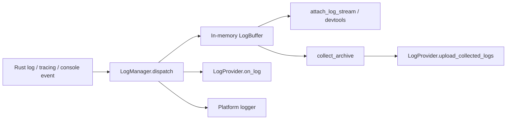

# Logging Design Doc

## Purpose

This document describes the current logging mechanism in LingXia runtime. It focuses on capability and runtime behavior:

- structured log model
- in-memory buffering
- native logger output
- realtime provider hook
- collected log archive flow
- devtools/live attach flow

This document does not define any specific backend transport or product integration.

Related implementation files:

- `crates/lingxia-observability/src/lib.rs`
- `crates/lingxia-lxapp/src/log.rs`
- `crates/lingxia-lxapp/src/provider.rs`
- `crates/lingxia/src/logging.rs`

## Architecture

There are two separate capability paths:

- Realtime path:
  - every structured log event passes through `LogManager.dispatch(...)`
  - the active `LogProvider` receives `on_log(&LogMessage)`
- Collect path:
  - caller explicitly asks to collect recent logs
  - runtime snapshots recent in-memory entries
  - entries are encoded to `jsonl.zst`
  - the active `LogProvider` receives `upload_collected_logs(CollectedLogArchive)`

## Core Data Model

`lingxia-observability` defines the shared log domain model:

- `LogMessage`
  - `timestamp_ms`
  - `tag`
  - `level`
  - `appid`
  - `path`
  - `target`
  - `message`
- `LogLevel`
  - `Verbose`, `Debug`, `Info`, `Warn`, `Error`
- `LogTag`
  - `Native`
  - `WebViewConsole`
  - `LxAppServiceConsole`

The model is intentionally transport-agnostic. It is valid for:

- platform logger output
- devtools streaming
- realtime forwarding to a provider
- compressed diagnostic archive generation

## Runtime Initialization

SDK bootstrap initializes logging in `crates/lingxia/src/logging.rs`:

1. `LogManager::init(...)` installs the global runtime log manager.
2. `log` crate integration is installed through `SdkLogger`.
3. `lxapp::log::init_tracing()` installs the tracing subscriber bridge.

After initialization:

- `log` crate records enter the LingXia structured log pipeline
- tracing events can also be normalized into `LogMessage`
- final output is still mirrored to the platform logger

## Dispatch Flow

Main dispatch logic is in `crates/lingxia-lxapp/src/log.rs`.

For each emitted `LogMessage`:

1. message is pushed into the in-memory `LogBuffer`
2. `get_log_provider().on_log(&message)` is called synchronously
3. message is written to the platform logger

Important properties:

- dispatch is synchronous
- provider hook runs on the caller's execution path
- provider hook must enqueue quickly and must not block on heavy I/O
- native/platform logger output still happens even when no custom log provider is registered

## Re-entrancy Rule

`LogProvider::on_log(...)` has a strict re-entrancy constraint, documented in `crates/lingxia-observability/src/lib.rs`:

- provider implementations must not emit LingXia log events from inside `on_log`
- same-thread re-entry is guarded
- cross-thread re-entry is not fully prevented

This rule exists to avoid recursive log emission loops.

## In-Memory Buffer Model

`LogBuffer` maintains:

- one bounded broadcast channel for live subscribers
- one bounded recent-history deque for replay and collection

Default capacities:

- live capacity: `1024`
- history capacity: `2048`
- default devtools recent limit: `500`

Semantics:

- recent history is bounded and old entries are evicted from the front
- live subscribers can receive new log events through broadcast
- recent snapshot and live receiver can be attached atomically to avoid replay/live gaps

## Devtools Attach Flow

The devtools-facing API is:

- `attach_log_stream(recent_limit)`
- `attach_log_stream_default()`

These APIs return:

- a recent replay window
- a live receiver for subsequent log items

This is designed for log viewers that need:

1. immediate recent context
2. continued live tailing

without missing the boundary between replayed entries and new entries.

## Collect Flow

The explicit collect API is:

- `upload_collected_logs(limit)`

Flow:

1. take recent entries from `LogBuffer`
2. serialize entries as JSON Lines
3. compress with zstd
4. build `CollectedLogArchive`
5. call `LogProvider.upload_collected_logs(...)`

The archive contains:

- file name
- content type
- encoding
- entry count
- involved lxapp IDs
- compressed bytes

Current archive encoding:

- file extension: `jsonl.zst`
- `content_type`: `application/zstd`
- `encoding`: `jsonl+zstd`

## Provider Boundary

The logging extension point is `LogProvider`.

It has two hooks:

- `on_log(&LogMessage)`
- `upload_collected_logs(CollectedLogArchive)`

Registration happens through:

- `register_log_provider(...)`

Behavior when no custom provider is registered:

- runtime uses `NoOpProvider`
- realtime provider forwarding becomes a no-op
- collected upload becomes a no-op
- local in-memory buffering and platform logger output still work

This separation is intentional:

- `lingxia-observability` defines capability and shared types
- `lingxia-lxapp` owns runtime dispatch and buffering
- concrete hosts/providers decide whether and how to forward logs elsewhere

## Source Inputs

The runtime can normalize logs from multiple sources into the same model:

- Rust `log` crate records
- tracing events
- view/appservice console events
- direct `lxapp::log::log(...)` calls
- `info!`, `warn!`, `error!`, `debug!`, `verbose!` helpers

All of these converge into `LogMessage`.

## Invariants

The current mechanism relies on these invariants:

1. Log dispatch must remain lightweight and synchronous.
2. Provider realtime hook must not perform blocking work inline.
3. Provider realtime hook must not emit LingXia logs recursively.
4. Recent history remains bounded in memory.
5. Collect always operates on recent in-memory logs, not an unbounded persisted log store.
6. Platform logger output is independent of whether a custom `LogProvider` is registered.
