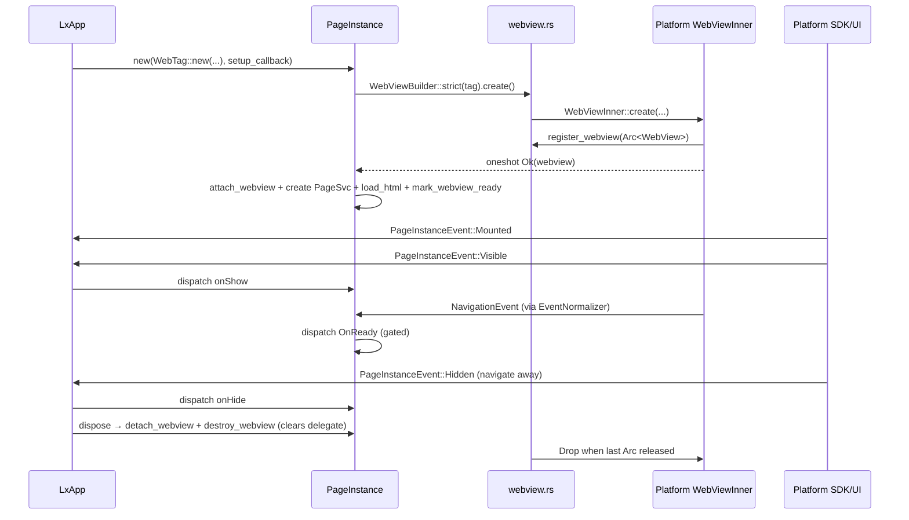
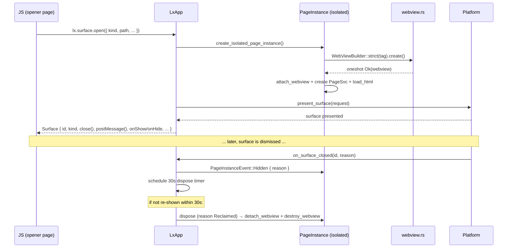
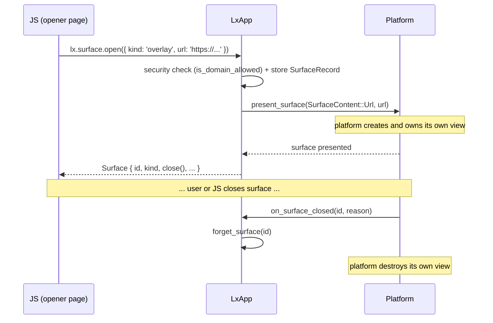
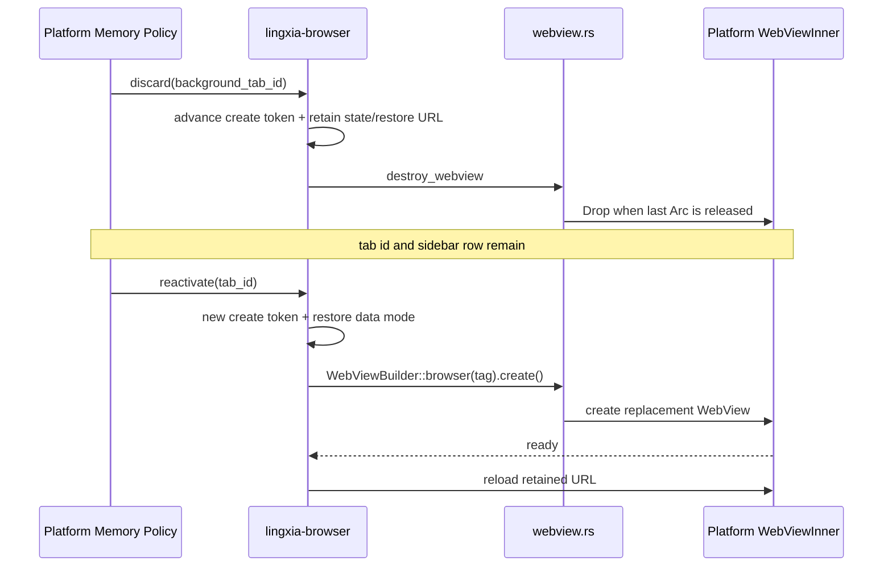
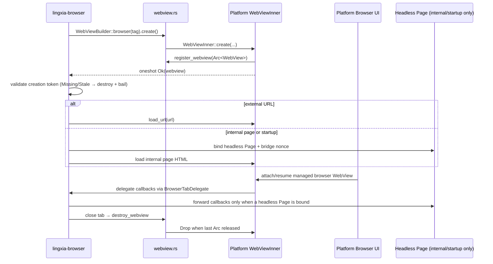

# WebView Lifecycle (Cross-Platform)

> Delegate contract: navigation and observable state are delivered as typed
> events (`NavigationEvent`, `WebViewStateChange`) through the per-WebView
> event normalizer in `crates/lingxia-webview/src/events/` — correlated ids,
> exactly-once terminals, coalesced state, flattened FIFO delivery. The
> legacy per-callback surface (`on_page_started`/`on_page_finished`/…) is
> gone. See the rustdoc on `WebViewDelegate` for the full invariants.

## Purpose

This document explains the end-to-end lifecycle of LingXia WebView instances —
how they are created, wired to page content, presented on screen, and torn down.
It spans the Rust core (`lingxia-webview`, `lingxia-lxapp`, `lingxia-browser`),
the platform bindings (Apple/Harmony/Android), and the SDK UI containers that
present the views.

## Read this first — the mental model

Five ideas explain almost everything below:

1. **The `lingxia-webview` core is deliberately dumb.** It knows how to create a
   native WebView, register scheme/navigation/download/file-chooser callbacks,
   load content, and tear down. It does **not** know about hosts, `openURL`,
   tabs, or pages. All policy (where an external link goes, what `lx://` means,
   how a tab is created) lives in the **callbacks the creator supplies**.
2. **The security profile is the real boundary, not the platform type.** Two
   profiles — `StrictDefault` (lxapp pages) and `BrowserRelaxed` (browser tabs) —
   decide data-store persistence, whether downloads/dialogs are allowed, and
   whether top-level `https://` is intercepted. Reason about a WebView by its
   profile, never by `WKWebView` vs Android `WebView` vs ArkWeb `Web`.
3. **`PageInstance` is the unit of app lifecycle.** It wraps a `Page` (which
   holds the `WebView`) and adds identity, ownership, presentation, and a
   disposal policy. App-page lifecycle events (`onLoad`/`onShow`/`onReady`/
   `onHide`/`onUnload`) fire on a `PageInstance`, not on the raw WebView.
4. **Visibility comes from the SDK container, not the core.** `onShow`/`onHide`
   are driven by the platform UI layer attaching/detaching the view
   (`PageInstanceEvent::Visible` / `Hidden`), never by `lingxia-webview` itself.
5. **Teardown is multi-edge and comes in different flavors.** The
   `Page ↔ WebView` reference cycle is broken by *two* separate actions, and
   "dispose", "evict", "detach", and "destroy_webview" are **not** synonyms —
   see [Teardown Paths](#teardown-paths).

### Who owns what

| Crate | Responsibility |
| --- | --- |
| `lingxia-webview` | Generic WebView core: creation, profiles, registry, callbacks, control surface, platform backends |
| `lingxia-lxapp` | `Page` / `PageInstance` lifecycle, page maps, surfaces, disposal/eviction |
| `lingxia-browser` | Browser tabs: tab state, `BrowserTabDelegate`, schemes, navigation/download/new-window routing |
| SDK (Apple/Android/Harmony) | UI containers that attach views and emit visibility events |

## Key types and naming

The doc uses readable names; this table maps them to the real Rust types so you
can grep. **Read "Page" as `PageInstance`** unless a `Page`-specific method is
named — the type that implements `WebViewDelegate` and drives lifecycle is
`PageInstance` (`lingxia-lxapp/src/page.rs`).

| Doc term | Real type / symbol | Notes |
| --- | --- | --- |
| Profile | `SecurityProfile::{StrictDefault, BrowserRelaxed}` | `pub(crate)`; chosen via the builder, not named by callers |
| Builder | `WebViewBuilder::strict(tag)` / `::browser(tag)` | Returns `StrictWebViewBuilder` / `BrowserWebViewBuilder` |
| WebTag | `WebTag(String)` | Newtype over a string `appid:path[#session]`; **construct with `WebTag::new(appid, path, session_id)`**, not as a tuple |
| Effective options | `EffectiveWebViewCreateOptions` | Records profile, registered scheme **names**, and handler/delegate **presence** (booleans) |
| Page | `PageInstance` (wraps `Page`) | `PageInstance` is the lifecycle/identity unit |
| Page id | `PageInstanceId(String)` | UUID v4 |
| Core creation stage | `WebViewCreateStage` | `Requested → NativeCreated → ControllerAttached → Ready → Destroyed` |

## WebView Profiles

Every WebView is created under one of two security profiles. The profile
determines navigation policy, storage, and whether app-page lifecycle events
fire.

| Profile | Builder | Content | Navigation policy | Page lifecycle |
| --- | --- | --- | --- | --- |
| `StrictDefault` | `WebViewBuilder::strict(tag)` | LxApp pages served via the `lx://` scheme | Creator-registered scheme handlers serve `lx`; the creator navigation handler decides everything else (lxapp policy: allow `lx`/`data`/`blob`, cancel the rest — see below) | Full `onLoad` → `onShow` → `onReady` → `onHide` → `onUnload` |
| `BrowserRelaxed` | `WebViewBuilder::browser(tag)` | External URLs (`https://`), browser internal pages via `lingxia://` | Normal web URLs load in-WebView; the creator's navigation/new-window/download/file-chooser handlers route the rest. No `https` interception | Only browser internal pages (headless `Page` bound via `BrowserTabDelegate`) |

> **The core layer does not route to a host by itself.** There is no built-in
> `lx`/`data`/`blob` allowlist and no `openURL` forwarding inside
> `lingxia-webview`. "Forward this external scheme to the host" is implemented by
> the **navigation handler the creator supplies** — `lingxia-lxapp` for strict
> pages (allow `lx`/`data`/`blob`, silently cancel `about:`, everything else →
> `open_url(External)` + cancel), `lingxia-browser` for tabs. The only scheme
> the core reserves is `lx-apple` (the Apple bridge transport); registering it
> is rejected by `normalize()`.

`StrictDefault` policy (what the core actually enforces):
- Non-persistent data store (Apple `WKWebsiteDataStore::nonPersistentDataStore`).
- A download handler is rejected at build time unless the profile is browser, so
  strict pages have no in-WebView download flow.
- Navigation policy is enforced by the navigation handler `lingxia-lxapp`
  registers (`page.rs`): `lx`/`data`/`blob` → allow; `about:` → silently
  cancelled; **everything else** (https/http, `tel:`, `mailto:`, …) → forwarded
  to the host via `open_url(…, External)` and the navigation cancelled. The
  host decides what to do with the URL; nothing external ever loads in a strict
  WebView.
- Apple-only extra layer: the navigation delegate has an
  `intercept_https_navigation` flag that can offer top-level `https://` to a
  registered `https` scheme handler. For lxapp pages this path is **dead
  code** — the navigation handler above cancels https first, and strict pages
  register no `https` scheme handler. Harmony (`onLoadIntercept` →
  `check_navigation_policy`) and Android (`shouldOverrideUrlLoading` →
  `handleNavigationPolicy`) route only through the navigation handler.

`BrowserRelaxed` policy:
- Default persistent data store.
- Downloads (`on_download`), file chooser, and JS dialogs are available.
- New windows are routed to the creator's new-window handler (`lingxia-browser`
  turns this into managed tab creation).
- No `https` interception; ordinary navigation is governed by the navigation
  handler only.

## WebView Kinds

All WebViews share the same Rust `WebView` type, but the runtime meaning differs
by who creates the instance and which profile is used.

| Kind | Created by | Profile | Content | Delegate | Page lifecycle |
| --- | --- | --- | --- | --- | --- |
| LxApp page | `LxApp` via `get_or_create_page()` / `create_page_instance()` | `StrictDefault` | Page HTML via `lx://` | `PageInstance` | Full |
| Surface (page target) | `LxApp::open_surface()` → `create_page_instance()` | `StrictDefault` | Page HTML via `lx://`, presented in overlay or window | `PageInstance` (isolated) | Full |
| Surface (URL target) | `LxApp::open_surface()` → platform `present_surface()` | Platform-managed; no Rust `WebView` | External URL passed as `SurfaceContent::Url` | None (Rust side) | None |
| Browser tab (external URL) | `lingxia-browser` | `BrowserRelaxed` | External `https://` URL | `BrowserTabDelegate` | None |
| Browser tab (internal page) | `lingxia-browser` | `BrowserRelaxed` | Browser shell UI via `lingxia://` | `BrowserTabDelegate` → headless `Page` | Full (headless page only) |
| Host-attached page | SDK container (Apple `LxAppHostView`) | An existing strict page WebView reparented into the host's view hierarchy | LxApp page | The page's existing `PageInstance` | Full (attachment triggers `onPageShow`) |

## PageInstance Model

A `PageInstance` wraps a `Page` (which holds the `WebView`) and is the unit that
`LxApp` tracks in its page maps. Its identity lives on the instance; its
ownership / presentation / disposal policy live in a side record
(`PageInstanceRuntimeRecord`, keyed by instance id in
`LxAppState.page_instance_runtime`).

### Identity

Every `PageInstance` has a unique `PageInstanceId` (UUID v4). A single page path
(e.g. `/home`) can have multiple `PageInstance` objects alive simultaneously —
for example, the main-window instance and a surface overlay instance of the same
path.

`LxApp` maintains two maps (both keyed by `String`):
- `pages`: `path → PageInstance` (the canonical instance for each path).
- `pages_by_id`: `instance_id → PageInstance` (all instances, including isolated
  ones).

An **isolated page instance** (created by `create_isolated_page_instance()`) is
registered only in `pages_by_id`, not in `pages`. This is used for surface page
targets so they don't replace the main-window page at the same path.

### Owner

Each `PageInstance` has a `PageOwner` that determines lifecycle coupling:

| Owner | Meaning | Surface close cascades? |
| --- | --- | --- |
| `Page(PageInstanceId)` | Created by another page (e.g. a surface opened from a page) | Yes — when the owner page is disposed, its owned surfaces are closed |
| `Scene(SceneId)` | Created by a scene / system-level context | No per-page cascade |
| `Host` | Fallback for pages without an explicit runtime record | No |

The owner is recorded in `PageInstanceRuntimeRecord` and used by
`close_surfaces_for_owner()` when a page instance is disposed.

> **Cascade reason is conditional.** The owned surfaces are closed with
> `CloseReason::OwnerClosed` normally, but with `CloseReason::AppClosed` when the
> disposal is part of app shutdown.

### Presentation Kind

`PresentationKind` records how the page is presented:

| Kind | Meaning |
| --- | --- |
| `Window` | Standard full page (main LxApp window, or a surface window) |
| `Overlay` | Surface overlay |
| `Panel` | Defined but currently **unused** — see note |

> **`Panel` is not reachable from surfaces today.** `SurfaceKind` only has
> `Window` and `Overlay`, and `open_surface()` maps `Window→Window`,
> `Overlay→Overlay`. No code path produces `Panel`; treat it as reserved.

### Dispose TTL and `CloseReason::Reclaimed`

A `PageInstance` can have an optional `dispose_ttl` (duration). When the page
receives a `Hidden` event whose reason is **not** `AppClosed`:

- If `dispose_ttl` is set: a timer is scheduled. When it fires, the instance is
  disposed (WebView destroyed, PageSvc terminated) **with reason
  `CloseReason::Reclaimed`** — distinct from the original `Hidden` reason, so JS
  can tell SDK-initiated resource reclamation apart from a user/programmatic
  close.
- If `dispose_ttl` is `None`: the page stays alive while hidden (no automatic
  disposal).

Surfaces use a **30-second** dispose TTL (`SURFACE_DISPOSE_TTL_MS = 30_000`).
Regular pages typically have no TTL (they survive hide/show cycles). A
`Hidden { reason: AppClosed }` always disposes immediately, ignoring any TTL.

### Lifecycle State Machine

```
Created → Mounted → Visible ⇄ Hidden → Disposed
```

Transitions are driven by `PageInstanceEvent`. `Visible`/`Hidden` before
`Mounted`, and any event after `Disposed`, are rejected.

| Event | Effect |
| --- | --- |
| `Mounted` | SDK container attached the view; cancels any pending dispose timer |
| `Visible` | Cancels the dispose timer, marks the instance active, dispatches `onShow` |
| `Hidden { reason }` | Dispatches `onHide`; then: `AppClosed` → dispose immediately; else if a dispose TTL is set → start the timer; else cancel the timer (page stays alive) |
| `Disposed { reason }` | Cancels the timer, then runs full disposal (see [PageInstance disposal](#pageinstance-disposal)) |
| `Resized { width, height }` | Informational; no state change |

## Core Objects and Ownership

- `WebTag`: identity of a WebView instance. A newtype over a string of the form
  `appid:path[#session]` (e.g. `myapp:/home#42`). Build it with
  `WebTag::new(appid, path, session_id)`; `key()` returns the full string
  (session suffix included, so instances are isolated per session).
- Global registry: `WEBVIEW_INSTANCES` (`HashMap<String, Arc<WebView>>`) holds
  all live WebView `Arc`s.
- `PageInstance` holds an `Option<Arc<WebView>>`.
- `WebView` holds an `Option<Arc<dyn WebViewDelegate>>` behind a lock (usually
  the `PageInstance` itself).
- `EffectiveWebViewCreateOptions` records the profile, the registered scheme
  **names**, and **presence** booleans for each handler/delegate. WebView reuse
  requires matching effective options (see below).

### Breaking the reference cycle

`PageInstance ↔ WebView` form a reference cycle. It is broken by **two distinct
edges**, and neither alone is sufficient:

1. `PageInstance::detach_webview()` drops the page-held `Arc<WebView>` (the
   page → webview edge). It does **not** touch the delegate.
2. `destroy_webview(webtag)` → `WebView::remove_delegate()` clears the delegate
   (the webview → delegate edge).

Full teardown performs both. The native object only drops once the **last**
`Arc<WebView>` is released, so map removal alone is not native teardown.

## Creation lifecycle

The core's creation progress is the `WebViewCreateStage` enum, observable via the
`WebViewSession` (`wait_ready()` returns the `Arc<WebView>`):

```
Requested → NativeCreated → ControllerAttached → Ready → Destroyed
```

On top of that, the lxapp layer wires the WebView to an owner and marks
readiness (`mark_webview_ready()` / `wait_webview_ready()` live in
`lingxia-lxapp`, not the core):

1. **Requested**: `WebViewBuilder::{strict,browser}(tag).…​.create()`.
2. **Native created / registered**: backend creates the native controller and
   `register_webview()` inserts the `Arc<WebView>` into the global map.
3. **Wired to owner**:
   - LxApp page: `PageInstance` stores the `Arc<WebView>`, delegate is the
     `PageInstance`, setup callback creates `PageSvc` and loads HTML.
   - Surface (page target): same, but the instance is isolated.
   - Surface (URL target): no Rust WebView; the platform receives the URL.
   - Browser tab: browser runtime stores tab state, delegate is
     `BrowserTabDelegate`, the pending URL or internal page is loaded.
4. **Ready**: setup callback completes; `mark_webview_ready()` is called.
5. **Rendering**: the backend submits native navigation signals; the
   per-WebView event normalizer delivers typed `NavigationEvent`s
   (`Started` → exactly one of `Succeeded`/`Failed`/`Cancelled`).
6. **Visible**: SDK container attaches/shows the view; for strict pages this
   triggers `onShow` via `PageInstanceEvent::Visible`.
7. **Detached/Destroyed**: both cycle edges cleared, references dropped, registry
   entry removed, native object torn down.

### WebView reuse rules (`create_webview_session`)

Keyed by `webtag.key()`:

| Situation | Result |
| --- | --- |
| No existing instance | Delegate to platform `WebViewInner::create()` |
| Exists, **different** effective options | **Fail** (`InvalidCreateOptions`) — never silently reuse an incompatible instance |
| Exists, same options, request carries **any** callbacks | **Fail** — callbacks are immutable after first create |
| Exists, same options, **no** callbacks | Reuse the existing instance |

## LxApp Page WebView

A standard LxApp page is created when the app navigates to a configured page
path. Entry points:
- `get_or_create_page()` — reuses the existing page at a path if present
  (updating its query), otherwise creates one and registers it in **both** maps,
  then runs LRU eviction if needed.
- `create_page_instance()` — creates with an explicit owner, presentation kind,
  and optional dispose TTL. A `PageOwner::Page` produces an isolated instance.

Creation:

1. Resolve the target (name or path) to a configured page path with extension.
2. Build `WebTag::new(appid, path, session_id)`.
3. `WebViewBuilder::strict(tag).…​.create()`, await readiness in a background task.
4. On success: `attach_webview()`, run setup (create `PageSvc` with ack,
   `load_html()`), `mark_webview_ready()`.
5. Register the `PageInstance` in the LxApp maps.

Visibility (`onShow` / `onHide`) is triggered by SDK container attachment events,
not by `lingxia-webview`. The SDK sends `PageInstanceEvent::Visible` when the
container appears and `Hidden` when it disappears.

## Surface WebView

Surfaces are secondary presentation targets (overlays, windows) opened via
`lx.surface.open(options)` in JS. The core implementation is
`LxApp::open_surface()`.

### Opening

1. JS calls `lx.surface.open({ kind, path|page|url, query?, size?, position? })`
   (exactly one of `page`/`path`/`url`).
2. `open_surface()` resolves the target:
   - **Page target** (`PageSurfaceTarget::Page`): calls `create_page_instance()`
     with `PageOwner::Page(current_page_instance_id)` and a `PresentationKind`
     derived from `SurfaceKind`. Creates an **isolated** instance — a full
     `StrictDefault` WebView with complete page lifecycle — with a 30-second
     dispose TTL.
   - **URL target** (`PageSurfaceTarget::Url`): no Rust WebView. The URL and
     `SurfaceContent::Url` are passed to the platform's
     `SurfacePresenter::present_surface()`, which owns the view. URL surfaces are
     gated by the lxapp security policy (`is_domain_allowed`), and `query`,
     percentage sizes, and `position` have overlay-only / kind-specific
     validation rules.
3. A `SurfaceRecord` is stored in `LxApp.state.surfaces`, keyed by surface id. It
   records **two** ids: `owner_page_instance_id` (who opened it) and
   `content_page_instance_id` (the page hosted *inside* it, for page targets).
4. The platform `SurfacePresenter` presents the native overlay/window UI.

### Closing

1. Trigger: JS `surface.close()`, the user dismissing the native UI, or the owner
   page being disposed.
2. `LxApp::close_surface()` calls `runtime.close_surface()` to dismiss the
   platform UI. On the success path the `SurfaceRecord` is removed when the
   platform's close callback fires (not inline).
3. Page-target surfaces: the platform close callback sends
   `PageInstanceEvent::Hidden { reason }`. Because of the 30-second dispose TTL,
   the WebView is **not** destroyed immediately — it stays alive for 30s and is
   disposed (reason `Reclaimed`) if not re-shown. This makes quick re-open cheap.
4. URL-target surfaces: the platform destroys its own view; the only Rust-side
   work is forgetting the surface record.

### Show / hide

Beyond open/close, surfaces have a visibility lifecycle: `show_surface()` /
`hide_surface()` and JS `onShow` / `onHide`. Visibility is mirrored across the
opener↔surface paired objects.

### Two cascades

When a page instance is disposed, **two** surface cleanups run:

- **Owner cascade** — `close_surfaces_for_owner(owner_id, reason)`: close every
  surface this page opened.
- **Content cascade** — `close_surfaces_hosting(content_id, reason)`: if this
  page is the *content* of a surface (it lives inside an overlay someone else
  opened), close that hosting surface too, propagating the real reason (e.g.
  `Reclaimed`). Without this, an SDK-side reclaim would dispose the page silently
  and the owner would keep `postMessage`-ing into a dead handle.

### Message channel

The opener page and the surface page communicate via `postMessage()` /
`onMessage()`. This is a `JSMessagePort` pair created inside the **app-service**
JS runtime — it is entirely independent of the WebView lifecycle (it does not
pass through any WebView).

## Browser Tab WebView

Browser tabs are managed by `lingxia-browser`, use the `BrowserRelaxed` profile,
and support normal web navigation.

Creation:

1. Allocate a tab id and a browser-tab path; build the webtag.
2. `WebViewBuilder::browser(tag)`, delegate `BrowserTabDelegate`.
3. Register handlers:
   - `lx://` — routes back to the owning LxApp context.
   - `lingxia://` — serves browser internal pages from the browser shell webui bundle.
   - navigation — normal web URLs stay in-WebView; external schemes are forwarded
     to the host via `open_url(..., External)`.
   - new-window — creates a new managed browser tab.
   - download — starts the LingXia download flow.
   - file chooser — delegates to the platform/media chooser.
4. When the session becomes ready:
   - External URL → `webview.load_url(url)`; **no** LxApp page lifecycle.
   - Internal browser page (`lingxia://`) **and** the no-URL startup case → bind a
     headless `Page` and load HTML with the bridge. This headless page gets full
     page lifecycle so the browser shell webui can use the LxApp bridge and appservice
     APIs.

> **Shared startup page.** All tabs share a single headless startup
> `PageInstance`; the active tab's WebView is what backs that bridge. Closing a
> tab only detaches the bridge when the closing tab currently backs it.

### Tab state and teardown

`BrowserTabState` holds the WebView creation state (`session_id`, `create_token`,
`create_in_flight`, `pending_url`), restorable browser metadata (`current_url`,
`title`, favicon and history state), discard state (`discarded`, `data_mode`),
and presentation/ownership flags. Note what is **not** in it:
- the **tab id** is the `HashMap` key, not a field;
- the **active tab** is tracked by a separate global (`BROWSER_ACTIVE_TAB_ID`);
- **download state** lives in the separate `lingxia_transfer` registry.

`create_token` is a monotonic per-tab token used to ignore stale async callbacks
when a tab is recreated quickly. On a create callback, `browser_tab_create_state`
returns `Missing` (tab closed during creation) or `Stale` (a newer create cycle
took over); both destroy the orphaned WebView and bail without attaching — this
is the in-flight reattach guard.

Tab teardown (`close_browser_tab`) must: remove tab state, detach the page if it
currently backs the shared bridge, `destroy_webview` the tab path/session, and
reassign the active tab if the closed one was active.

### Browser tab discard and reactivation

Discard is memory reclamation, not tab teardown. It destroys a background
tab's native WebView, controller, and JS heap while keeping the
`BrowserTabState` and sidebar row. The core implementation lives in
`crates/lingxia-browser/src/tabs.rs`. The lifecycle is:

```
Live -> Discarded -> Recreating -> Live
```

`discard_browser_tab(tab_id)`:

1. Rejects the Rust-side active tab. The host must keep
   `BROWSER_ACTIVE_TAB_ID` synchronized with its visible selection.
2. Advances `create_token` **before** destruction. An older in-flight create
   callback then resolves as `Stale` and cannot remove or reattach the retained
   tab.
3. Detaches the tab from the shared startup bridge and removes any per-tab
   internal `Page`.
4. Calls `destroy_webview` for the tab path/session.
5. Keeps the tab map entry, sets `discarded = true`, clears
   `create_in_flight`, and preserves `pending_url` (falling back to
   `current_url`) as the restore target.

`reactivate_browser_tab(tab_id)` reverses that operation. For a discarded tab
it allocates a new create token, restores the original `data_mode`, creates a
new browser-profile WebView, and reloads the saved URL through the normal
creation callback. For an already-live tab it only synchronizes active state.
If recreation fails, the entry returns to `discarded` so a later activation can
retry.

Discard deliberately retains the tab id, URL, title, favicon, ownership, and
sidebar position. It does not emit page `onHide`/`onUnload` and must not run the
close-tab successor logic. A subsequent user activation therefore looks like
an ordinary tab switch, except the document reloads in a newly created WebView.

Platform hosts decide *when* to discard:

- **macOS:** `BrowserTabCoordinator`
  (`lingxia-sdk/apple/Sources/Platform/macOS/BrowserTabCoordinator.swift`)
  maintains activation recency and idle
  timestamps. A memory-pressure warning discards background tabs idle for at
  least 60 seconds; critical pressure discards all eligible background tabs.
  A periodic sweep also discards tabs idle for 30 minutes. The active tab is
  excluded; `isProtectedFromDiscard` is the extension point for pinned or
  audio-playing tabs. Leaving browser UI clears the Rust-side active browser
  state, so the last visible tab becomes eligible once it is backgrounded.
- **Windows:** the shell policy in
  `crates/lingxia-windows-sdk/src/shell/runtime.rs` maintains LRU activation
  order and caps the number of
  live browser WebViews according to physical memory. The budget is one quarter
  of physical memory at an estimated 256 MiB per tab, clamped to 4 through 16
  live tabs (8 if memory detection fails). Tab changes and presentation both
  run the policy. When over the cap, it discards the oldest background tabs
  while protecting the Rust-side active tab, the actually presented tab, and
  the incoming tab. Presentation calls `reactivate` before waiting for WebView2
  readiness.

## Page Lifecycle Events vs WebView Callbacks

`PageInstance` implements `WebViewDelegate`:
- `on_navigation_event(Started)` → sets render status `Started`.
- `on_navigation_event(Succeeded)` for the **current attempt** (folded
  through `NavigationProgress`) → calls `handle_loaded()`, which sets render status
  `Finished`, injects page scripts, then dispatches `OnReady` **via**
  `dispatch_lifecycle_event` (so `OnReady` is gated, not unconditional).
- `on_load_error()` → reports a `LoadError` (default no-op).

`dispatch_lifecycle_event()` enforces ordering:
- `OnLoad` is ignored before render starts.
- First-load / re-navigation order: `OnLoad` (query-aware) → `OnShow`
  (visibility) → `OnReady` (after render finished, once per logical load).
- `OnHide` on visibility loss; `OnUnload` on disposal.

Browser-profile WebViews only participate in this state machine when their
delegate resolves to a bound headless `Page`. External-URL tabs and URL-target
surfaces are WebView-lifecycle only — no app page lifecycle events fire.

## Platform-Specific Creation and Ready Semantics

### Apple (iOS/macOS)

1. `WebViewInner::create()` dispatches to the main thread, builds a
   `WKWebViewConfiguration`, creates the `WKWebView`.
2. Registers the reserved `lx-apple` bridge scheme plus the schemes the creator
   registered (for a strict lxapp page that is `lx`; the `lingxia` scheme appears
   only for browser tabs, because `lingxia-browser` adds it to its registered
   schemes — it is **not** hardcoded here). Also installs the navigation delegate
   and the script message handlers named `LingXia` and `LingXiaConsole`.
3. Profile policy:
   - `StrictDefault`: non-persistent `WKWebsiteDataStore`; the navigation
     delegate additionally carries an Apple-only `intercept_https_navigation`
     flag (unused by lxapp pages in practice — the navigation handler cancels
     https before it applies).
   - `BrowserRelaxed`: default persistent data store.
4. `create_and_register_sync()` wraps with `Arc<WebView>`, registers in the
   global map, fulfills the oneshot.

Callbacks:
- `didStartProvisionalNavigation` → `NativeSignal::NavigationStarted` (keyed
  by `WKNavigation` identity; URL captured in the callback).
- `didCommitNavigation` → `NativeSignal::DocumentCommitted` (metadata reset).
- `didFinishNavigation` / `didFail*` → `NativeSignal::NavigationFinished`
  (success / failure / cancellation; cancellation is control flow).
- `decidePolicyForNavigationAction`: the creator's navigation handler runs first
  (both profiles); strict carries an additional (currently inert) top-level
  `https://` interception behind it.

Visibility hook:
- `WebViewManager.attachWebViewToContainer()` (Swift) reparents the view,
  resumes it, and triggers `onPageShow(appId, path)` for tagged WebViews.
- `LxAppHostView` wraps a `LxAppController` for host-application embedding; the
  WebView is an existing strict page WebView that gets full page lifecycle after
  attachment triggers visibility events.

### Harmony (OHOS)

Two-phase creation (different from Apple/Android):

1. Rust `WebViewInner::create()`:
   - Constructs `WebViewInner`, **registers immediately** in the Rust map.
   - Serializes `EffectiveWebViewCreateOptions` into an options token.
   - Calls ArkTS `createWebViewController(webtag, optionsToken)`.
   - Sets scheme handlers.
2. ArkTS stores the options token, creates a `WebviewController`, emits a UI
   callback.
3. When the `Web` component appears, the `LingXiaWebView` component's
   `Web.onAppear` calls `notifyWebViewControllerAttached(webTag)`, which routes
   through to the NAPI `onWebviewControllerCreated(webtag)`. (The ack originates
   in `LingXiaWebView`, not `LxAppContainer`.)
4. Rust `webview_controller_created()` syncs the tag, clears stale state,
   registers ArkWeb lifecycle callbacks and the JS proxy, and sends the creation
   oneshot `Ok(webview)`.

Destroy:
- Rust `Drop for WebViewInner` → ArkTS `destroyWebViewController(webtag)`.
- ArkTS notifies Rust `onWebviewControllerDestroyed(webtag)`.
- Rust performs idempotent cleanup of ports/proxy/scheme handlers.

Rendering and visibility:
- ArkWeb `onPageBegin`/`onPageEnd` (wired at the native callback layer in Rust) →
  delegate start/finish.
- Navigation: ArkTS `onLoadIntercept` → NAPI `check_navigation_policy(webtag, url)`
  → the creator's navigation handler (`NavigationPolicy::Cancel` intercepts).
- `LxAppContainer.finishTransition()` triggers `onPageShow`.
- `Web.onAppear` does the controller-created ack only (avoids a duplicate
  `onPageShow`).

Harmony `Web` settings (in `LingXiaWebView.ets`) are profile-aware:
`.domStorageAccess(isBrowserRelaxed)`, `.fileAccess(false)`,
`.databaseAccess(isBrowserRelaxed)`, `.mixedMode(MixedMode.None)`. JS dialogs are
suppressed in strict, allowed in browser.

### Android

- Rust requests Java-side creation (`requestWebView`), stores the oneshot sender.
- Java→JNI callback (`notifyWebViewReady`) completes creation and registers the
  delegate callbacks.
- JNI forwards page events (`onPageStarted`/`onPageFinished`) to the
  `WebViewDelegate`.
- Navigation: `LingXiaWebViewClient.shouldOverrideUrlLoading` →
  `handleNavigationPolicy` → the creator's navigation handler.
- `Drop for WebViewInner` calls Java `destroy()`.
- LxApp pages are attached by `LxAppActivity`; browser tabs by
  `LxAppBrowserOverlay`.

## Teardown Paths

There are several teardown actions; they are **not** interchangeable. This table
is the quickest way to keep them straight:

| Action | What it does | OnHide/OnUnload? | detach_webview? | Surface cascades? | Native drop? |
| --- | --- | --- | --- | --- | --- |
| `detach_webview()` | Drops the page→webview `Arc` (one cycle edge) | No | — | No | Only if it was the last `Arc` |
| `destroy_webview(tag)` | Removes registry entry + clears delegate (other cycle edge) | No | No | No | When last `Arc` released |
| `dispose_page_instance_internal()` | Full page-instance teardown | Yes | Yes | Yes (both) | Yes (via the two edges) |
| LRU eviction | Lightweight reclaim of an inactive page | **No** | **No** | **No** | Yes |
| Browser tab discard | Destroys a background tab WebView but retains restorable tab state | No | Internal browser page only | No | Yes; recreated on activation |

### PageInstance disposal

`dispose_page_instance_internal()` is the full teardown path, in this order:

1. Cancel any pending dispose timer.
2. **Owner cascade**: `close_surfaces_for_owner()` (reason `AppClosed` during
   shutdown, else `OwnerClosed`).
3. **Content cascade**: `close_surfaces_hosting()` — close the surface that hosts
   this page, propagating the real reason.
4. Dispatch `onHide` (if not already hidden), then `onUnload`.
5. `page.detach_webview()`.
6. Cancel pending view calls for this instance.
7. Remove from `pages` (only if it is the canonical instance for the path),
   `pages_by_id`, `page_instance_runtime`, and the page stack.
8. `destroy_webview(&page.webtag())`.
9. Terminate `PageSvc`.

Disposal is triggered by:
- `PageInstanceEvent::Hidden { reason: AppClosed }` — immediate.
- `PageInstanceEvent::Hidden` with a dispose TTL — timer-based, reason
  `Reclaimed` (used by surfaces).
- `PageInstanceEvent::Disposed { reason }` — explicit.

### LRU eviction (distinct from disposal)

When the page count exceeds `tabbar_items + PAGE_STACK_MAX` (`PAGE_STACK_MAX = 10`),
`evict_inactive_pages_if_needed()` removes the single oldest page (by
`last_active_time`, excluding the current page and tabbar pages). Eviction is a
**lighter** path than disposal: it terminates `PageSvc`, cancels the dispose
timer, cancels view calls, removes the instance from `pages`/`pages_by_id`/
`page_instance_runtime`, and calls `destroy_webview` — but it does **not**
dispatch `onHide`/`onUnload`, does **not** call `detach_webview()`, and does
**not** run the surface cascades.

### LxApp shutdown order

`shutdown_with_options()`:

1. Set status `Closing` (suppresses `TerminatePage` from `PageInstance` drops).
2. `clear_transient_files()`.
3. `cancel_all_page_instance_dispose_timers()`.
4. `close_all_surfaces(AppClosed)`.
5. Clear key-event state.
6. Hide the runtime window (unless `skip_hide`).
7. Collect page webtags + cancel pending view calls.
8. `detach_webview()` for all pages.
9. Clear `pages`, `pages_by_id`, `page_instance_runtime`.
10. `destroy_webview()` for each webtag.
11. Clear the page stack.
12. Terminate the app service.

> Note the order: surfaces are closed and timers cancelled **before** the window
> is hidden.

### Surface teardown

- `close_surface()` calls the platform `close_surface()`; the record is removed
  when the platform close callback fires.
- Page-target surfaces: the 30-second dispose TTL controls when the WebView is
  actually destroyed (reason `Reclaimed`).
- URL-target surfaces: the platform destroys its own view.

### Browser tab teardown

Owned by `lingxia-browser`: remove tab state, reject stale creation tokens,
cancel pending URL state, `destroy_webview`, and prevent reattachment of
in-flight WebViews to closed tabs (the `Missing`/`Stale` guard). This is the
permanent close path. Browser tab discard instead retains the state, advances
the token, and uses the `Stale` guard to protect the retained entry until
reactivation creates a replacement WebView.

## Known Pitfalls

- **Reuse semantics**: the same `WebTag` does not imply a fresh instance.
  Different effective options are rejected; even matching options are rejected if
  the recreate request carries callbacks (callbacks are immutable after first
  create).
- **`detach_webview()` does not clear the delegate.** Breaking the
  `PageInstance ↔ WebView` cycle takes both `detach_webview()` *and*
  `destroy_webview()` → `remove_delegate()`.
- **`onPageShow` is fired in the SDK/UI container layer**, not in
  `lingxia-webview`.
- **Eviction ≠ disposal.** LRU eviction skips `onHide`/`onUnload`,
  `detach_webview`, and surface cascades. Do not assume an evicted page ran the
  full disposal path.
- **`Reclaimed` is its own close reason.** A surface WebView reclaimed after its
  30s TTL closes with `Reclaimed`, not the user/programmatic reason — JS relies
  on this distinction.
- **Surface content cascade matters.** Disposing a page that is the *content* of
  a surface closes that surface (`close_surfaces_hosting`); otherwise the owner
  keeps a live handle to a dead page.
- **Harmony creation is async-ack on UI `onAppear`.** Treating
  `createWebViewController` as fully ready is incorrect; wait for
  `onWebviewControllerCreated`.
- **`destroy_webview()` without detaching page references can delay native drop**
  (the native object only drops when the last `Arc<WebView>` is released).
- **Browser external pages have no LxApp page lifecycle.** Do not wait for
  `wait_webview_ready()` on a normal web URL tab. Internal pages (and the shared
  startup page) are the exception — they bind a headless `Page`.
- **Browser tab discard is not close.** Do not remove the tab state or run
  successor selection while reclaiming memory. Keep host active state in sync
  before discarding, and always reactivate a discarded tab before attempting to
  present its WebView.
- **External-navigation policy lives in the lxapp navigation handler, not in
  the core or the Apple https interception.** If you need to change what
  happens when a strict page hits an external URL, edit the handler in
  `lingxia-lxapp/src/page.rs`, on every platform at once.
- **Do not use strict page WebViews for general web browsing** — that bypasses
  browser-profile policy for storage, downloads, file chooser, and external
  navigation.
- **`Panel` presentation kind is currently unused** — surfaces only produce
  `Window` or `Overlay`.

## Sequence: LxApp Page



## Sequence: Surface (Page Target)



## Sequence: Surface (URL Target)



## Sequence: Browser Tab Discard and Reactivation



## Sequence: Browser Tab


